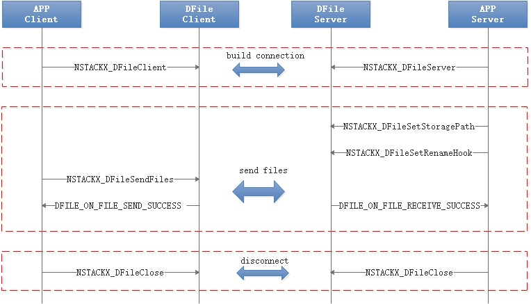
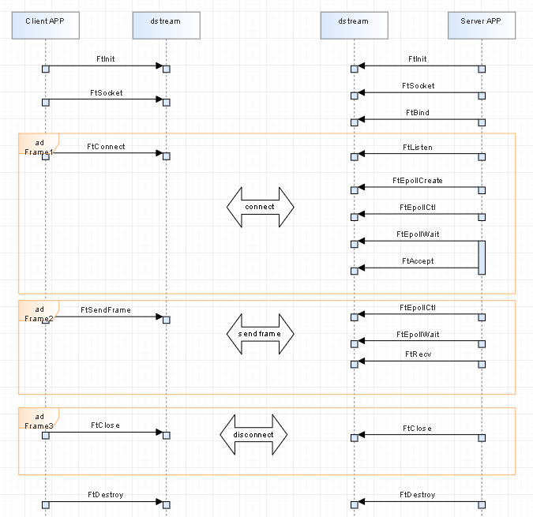

# t2stack

#### Description
t2stack is a collective name for the simplified network protocol stack and its supporting middleware for intelligent terminal scenarios, which mainly provides two core transmission capabilities: file and stream, and is suitable for multiple operating system platforms.

File transfer capability: Mainly for file sharing and cloning scenarios, compared with the Linux kernel protocol stack used before the application, the innovative protocol of t2stack can provide higher bandwidth utilization and lower latency than TCP in the WIFI environment, and provide a variety of optimizations in file transfer, such as large and small file collaboration, small file packaging and other purposes.

Streaming capability: Mainly for video streaming and audio streaming scenarios, it implements three competitive solutions, including semi-reliable transmission, adaptive bandwidth evaluation bitrate, and dynamic caching for weak network detection, to optimize user experience.

#### Instructions

t2stack main code directory structure is as follows：

```text
//t2stack
├── fillp                  # Streaming protocol code
│   ├── include            # VTP External interface code
│   ├── src                # VTP Core code
├── nstackx_congestion     # congestion algorithms public module
│   ├── interface          # External interface code
│   ├── core               # Core code
│   ├── platform           # Adaptation code for different platforms
├── nstackx_core           # File transfer protocol code
│   ├── dfile              # DFile protocol code
│   |   ├── include        # DFile External interface code
│   |   ├── src            # DFile Core code
│   ├── platform           # Adaptation code for different platforms
├── nstackx_ctrl           # ctrl module
│   ├── interface          # External interface code
│   ├── core               # Core code
│   ├── platform           # Adaptation code for different platforms
├── nstackx_util           # public module
│   ├── interface          # External interface code
│   ├── core               # Core code
│   ├── platform           # Adaptation code for different platforms
```

#### Introduction to the main interface functions

##### File Transfer
1.  Establish a connection
    NSTACKX_DFileServer:Create a file transfer server
    NSTACKX_DFileClient:Create a file transfer client
    NSTACKX_DFileClose:close file trasfer
2.  File transfer
    NSTACKX_DFileSendFiles:client send files
    NSTACKX_DFileSetStoragePath:server set file's storage path
    NSTACKX_DFileSetRenameHook:Set a callback function on server end to rename files with the same path and the same file name to prevent them from being overwritten
3.  Get and Set Capabilities
    NSTACKX_DFileGetCapabilities:Get DFile's Capabilities
    NSTACKX_DFileSetCapabilities:Set DFile's Capabilities
4.  Interactive processes



##### Stream Transfer
1.  Initialize and destroy
    FtInit:initialize the VTP/FillP stack
    FtDestroy:deinitialize the FillP stack
2.  Establish a connection
    FtSocket:create socket
    FtBind:bind socket and address on server
    FtListen:listen for connections on a socket
    FtAccept:acccept a connection on a socket
    FtConnect:Initiate a connection on a socket
3.  Send and recv
    FtSendFrame:Send a video frame on a socket
    FtRecv:receive messages from a socket
4.  Close a connection
    FtClose:close the socket connection and releases all associated resources
5.  Interactive processes



##### For more information about APIs, see API Documentation
