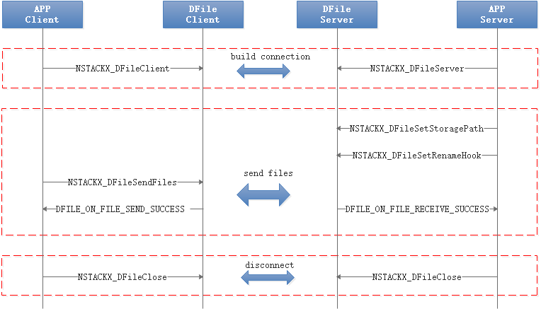
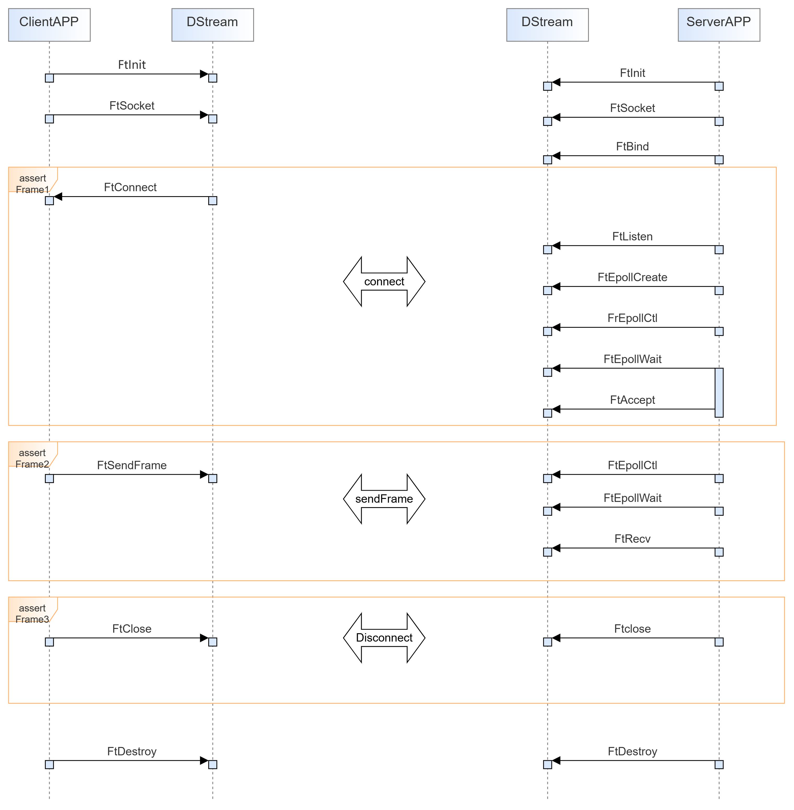

# t2stack接口说明

<h2>1.1 总体设计</h2>

如下表所示，TongTu RivulNET提供文件传输、流传输能力。TongTu RivulNET编译后以so形式被APP集成，用于近场文件、流数据传输。

<table width="529">
<tbody>
<tr>
<td width="22%">

接口类型

</td>
<td width="78%">

说明

</td>
</tr>
<tr>
<td width="22%">

文件传输

</td>
<td width="78%">

用于近场设备之间传输文件，聚焦于高带宽利用率和高吞吐。

</td>
</tr>
<tr>
<td width="22%">

流传输

</td>
<td width="78%">

用于远近场设备之间传输音视频流，聚焦于低时延的流畅播放。

</td>
</tr>
</tbody>
</table>

&nbsp;

<h2>1.2 文件传输接口</h2>
<h3>1.2.1 建立连接</h3>
<h4>1.2.1.1 NSTACKX_DFileServer</h4>
<table width="529">
<tbody>
<tr>
<td colspan="4" width="100%">

接口名称：

</td>
</tr>
<tr>
<td colspan="4" width="100%">

NSTACKX_DFileServer

</td>
</tr>
<tr>
<td colspan="4" width="100%">

描述：

</td>
</tr>
<tr>
<td colspan="4" width="100%">

创建文件传输服务端

</td>
</tr>
<tr>
<td colspan="4" width="100%">

调用条件：

</td>
</tr>
<tr>
<td colspan="4" width="100%">

无

</td>
</tr>
<tr>
<td colspan="4" width="100%">

接口原型：

</td>
</tr>
<tr>
<td colspan="4" width="100%">

int32_t NSTACKX_DFileServer(struct sockaddr_in *localAddr, socklen_t addrLen, const uint8_t *key, uint32_t keyLen, DFileMsgReceiver msgReceiver);

</td>
</tr>
<tr>
<td colspan="4" width="100%">

typedef void (*DFileMsgReceiver)(int32_t sessionId, DFileMsgType msgType, const DFileMsg *msg);

</td>
</tr>
<tr>
<td colspan="4" width="100%">

/* DFile session message type list. */

typedef enum {

DFILE_ON_CONNECT_SUCCESS = 1,

DFILE_ON_CONNECT_FAIL,

DFILE_ON_FILE_LIST_RECEIVED,

DFILE_ON_FILE_RECEIVE_SUCCESS,

DFILE_ON_FILE_RECEIVE_FAIL,

DFILE_ON_FILE_SEND_SUCCESS,

DFILE_ON_FILE_SEND_FAIL,

DFILE_ON_FATAL_ERROR,

DFILE_ON_SESSION_IN_PROGRESS,

DFILE_ON_TRANS_IN_PROGRESS,

DFILE_ON_SESSION_TRANSFER_RATE,

DFILE_ON_BIND,

DFILE_ON_CLEAR_POLICY_FILE_LIST，

} DFileMsgType;

/*

* DFile session message data. User should fetch corresponding member variable based on message type:

*&nbsp;&nbsp;&nbsp;&nbsp; DFileMsgType&nbsp; Member variable

*&nbsp;&nbsp;&nbsp;&nbsp; DFILE_ON_CONNECT_SUCCESS&nbsp;&nbsp;&nbsp;&nbsp;&nbsp;&nbsp;&nbsp;&nbsp;&nbsp;&nbsp;&nbsp;&nbsp;&nbsp; none

*&nbsp;&nbsp;&nbsp;&nbsp; DFILE_ON_CONNECT_FAIL&nbsp;&nbsp;&nbsp;&nbsp;&nbsp;&nbsp;&nbsp;&nbsp;&nbsp;&nbsp;&nbsp;&nbsp;&nbsp;&nbsp;&nbsp;&nbsp; errorCode

*&nbsp;&nbsp;&nbsp;&nbsp; DFILE_ON_FILE_LIST_RECEIVED&nbsp;&nbsp;&nbsp;&nbsp;&nbsp;&nbsp;&nbsp;&nbsp;&nbsp;&nbsp; fileList

*&nbsp;&nbsp;&nbsp;&nbsp; DFILE_ON_FILE_RECEIVE_SUCCESS&nbsp;&nbsp;&nbsp;&nbsp;&nbsp;&nbsp;&nbsp;&nbsp; fileList and transferUpdate

*&nbsp;&nbsp;&nbsp;&nbsp; DFILE_ON_FILE_RECEIVE_FAIL&nbsp;&nbsp;&nbsp;&nbsp;&nbsp;&nbsp;&nbsp;&nbsp;&nbsp;&nbsp;&nbsp; fileList, errorCode and transferUpdate. fileList maybe empty, as not all the file names are received.

*&nbsp;&nbsp;&nbsp;&nbsp; DFILE_ON_FILE_SEND_SUCCESS&nbsp;&nbsp;&nbsp;&nbsp;&nbsp;&nbsp;&nbsp;&nbsp;&nbsp;&nbsp;&nbsp; fileList and transferUpdate

*&nbsp;&nbsp;&nbsp;&nbsp; DFILE_ON_FILE_SEND_FAIL&nbsp;&nbsp;&nbsp;&nbsp;&nbsp;&nbsp;&nbsp;&nbsp;&nbsp;&nbsp;&nbsp;&nbsp;&nbsp;&nbsp; fileList, errorCode and transferUpdate.

*&nbsp;&nbsp;&nbsp;&nbsp; DFILE_ON_TRANS_IN_PROGRESS&nbsp;&nbsp;&nbsp;&nbsp;&nbsp;&nbsp;&nbsp;&nbsp;&nbsp;&nbsp;&nbsp; transferUpdate and fileList. Transfer process update of target trans identified by the transId.

*&nbsp;&nbsp;&nbsp;&nbsp; DFILE_ON_SESSION_IN_PROGRESS&nbsp;&nbsp;&nbsp;&nbsp;&nbsp;&nbsp;&nbsp;&nbsp;&nbsp; transferUpdate. Transfer process update of the whole session.

*&nbsp;&nbsp;&nbsp;&nbsp; DFILE_ON_FATAL_ERROR&nbsp;&nbsp;&nbsp;&nbsp;&nbsp;&nbsp;&nbsp;&nbsp;&nbsp;&nbsp;&nbsp;&nbsp;&nbsp;&nbsp;&nbsp;&nbsp;&nbsp; errorCode. DFileSession cannot be used any more, and should be destroyed.

*&nbsp;&nbsp;&nbsp;&nbsp; DFILE_ON_SESSION_TRANSFER_RATE&nbsp;&nbsp;&nbsp;&nbsp;&nbsp;&nbsp;&nbsp; rate.

*&nbsp;&nbsp;&nbsp;&nbsp; DFILE_ON_BIND&nbsp;&nbsp;&nbsp;&nbsp;&nbsp;&nbsp;&nbsp;&nbsp;&nbsp; socket ip and port.

*&nbsp;&nbsp;&nbsp;&nbsp; DFILE_ON_CLEAR_POLICY_FILE_LIST&nbsp;&nbsp;&nbsp;&nbsp;&nbsp;&nbsp;&nbsp;&nbsp;&nbsp; fileList

* It's invalid when for other message types.

*/

</td>
</tr>
<tr>
<td colspan="4" width="100%">

typedef struct {

struct {

const char **files;

uint32_t fileNum;

uint16_t transId;

char *userData;

} fileList;

struct {

uint32_t fileNum;

const DFileFileInfo *fileInfo;

} clearPolicyFileList;

struct {

uint16_t transId;

uint64_t totalBytes;

uint64_t bytesTransferred;

} transferUpdate;

int32_t errorCode;

uint32_t rate;

struct sockaddr_in sockAddr[NSTACKX_MULTI_PATH_NUM];

} DFileMsg;

</td>
</tr>
<tr>
<td colspan="4" width="100%">

参数：

</td>
</tr>
<tr>
<td width="25%">

名称

</td>
<td width="25%">

方向

</td>
<td colspan="2" width="50%">

描述

</td>
</tr>
<tr>
<td width="25%">

localAddr

</td>
<td width="25%">

[IN]

</td>
<td colspan="2" width="50%">

服务端监听的地址和端口

</td>
</tr>
<tr>
<td width="25%">

addrLen

</td>
<td width="25%">

[IN]

</td>
<td colspan="2" width="50%">

localAddr的长度

</td>
</tr>
<tr>
<td width="25%">

key

</td>
<td width="25%">

[IN]

</td>
<td colspan="2" width="50%">

文件内容传输支持加解密，key为传递进来的密钥。key可以为NULL。约束见下文。

</td>
</tr>
<tr>
<td width="25%">

keyLen

</td>
<td width="25%">

[IN]

</td>
<td colspan="2" width="50%">

上述key的长度，为0或者16或者32。约束见下文。

</td>
</tr>
<tr>
<td width="25%">

msgReceiver

</td>
<td width="25%">

[IN]

</td>
<td colspan="2" width="50%">

回调函数，用于TongTu RivulNET通过回调的方式反馈文件传输进度、发送成功或失败及其它事件等信息。

</td>
</tr>
<tr>
<td colspan="4" width="100%">

返回值：

</td>
</tr>
<tr>
<td width="25%">

类型

</td>
<td colspan="2" width="50%">

返回值

</td>
<td width="25%">

描述

</td>
</tr>
<tr>
<td rowspan="2" width="25%">

int32_t

</td>
<td colspan="2" width="50%">

大于0的sessionId

</td>
<td width="25%">

成功时返回sessionId

</td>
</tr>
<tr>
<td colspan="2" width="50%">

小于0的错误码

</td>
<td width="25%">

失败时返回错误码

</td>
</tr>
<tr>
<td colspan="4" width="100%">

接口使用约束：

</td>
</tr>
<tr>
<td colspan="4" width="100%">

1.由调用者保证localAddr内IP地址和端口的正确性，保证addrLen长度的正确性，不正确的地址和长度对TongTu RivulNET的影响是未定义的。

2.由调用者保证key的地址有效，保证keyLen长度的内存可访问，不正确的参数会导致TongTu RivulNET内存访问错误。key为NULL、keyLen为0也是有效的参数，表示不设置密钥。

3.由调用者保证msgReceiver为正确的函数指针，不正确的函数指针会导致不可预料的后果。

4.文件传输成功与否优先由 DFILE_ON_FILE_SEND_SUCCESS （发送端）和 DFILE_ON_FILE_RECEIVE_SUCCESS（接收端）回调保证。

若发送端在上述回调成功后收到DFILE_ON_FATAL_ERROR回调，可以忽略，此时语义为链路断开或其他异常，但文件已传输成功

5.如果keyLen=0，表示不使用加密，由上层保证文件的完整性和机密性；如果keyLen=16，适用于AES-GCM算法，即当前DFile使用的算法；keyLen=32，作为保留的对其他加密算法的扩展。

6.当key为NULL时，因不校验传输内容，存在攻击者向Server端传输文件的风险，为保持兼容性无法去除该功能，建议上层使用加密方式。

</td>
</tr>
</tbody>
</table>

&nbsp;

<h4>1.2.1.2 NSTACKX_DFileClient</h4>
<table width="529">
<tbody>
<tr>
<td colspan="4" width="100%">

接口名称：

</td>
</tr>
<tr>
<td colspan="4" width="100%">

NSTACKX_DFileClient

</td>
</tr>
<tr>
<td colspan="4" width="100%">

描述：

</td>
</tr>
<tr>
<td colspan="4" width="100%">

创建文件传输客户端，连接到服务端。

</td>
</tr>
<tr>
<td colspan="4" width="100%">

调用条件：

</td>
</tr>
<tr>
<td colspan="4" width="100%">

无

</td>
</tr>
<tr>
<td colspan="4" width="100%">

接口原型：

</td>
</tr>
<tr>
<td colspan="4" width="100%">

int32_t NSTACKX_DFileClient(struct sockaddr_in *srvAddr, socklen_t addrLen, const uint8_t *key, uint32_t keyLen, DFileMsgReceiver msgReceiver);

</td>
</tr>
<tr>
<td colspan="4" width="100%">

参数：

</td>
</tr>
<tr>
<td width="25%">

名称

</td>
<td width="25%">

方向

</td>
<td colspan="2" width="50%">

描述

</td>
</tr>
<tr>
<td width="25%">

srvAddr

</td>
<td width="25%">

[IN]

</td>
<td colspan="2" width="50%">

服务端监听的地址和端口

</td>
</tr>
<tr>
<td width="25%">

addrLen

</td>
<td width="25%">

[IN]

</td>
<td colspan="2" width="50%">

srvAddr的长度

</td>
</tr>
<tr>
<td width="25%">

key

</td>
<td width="25%">

[IN]

</td>
<td colspan="2" width="50%">

文件内容传输支持加解密，key为传递进来的密钥。key可以为NULL。客户端和服务端的key必须完全一样。

</td>
</tr>
<tr>
<td width="25%">

keyLen

</td>
<td width="25%">

[IN]

</td>
<td colspan="2" width="50%">

上述key的长度，为0或者16或者32。

</td>
</tr>
<tr>
<td width="25%">

msgReceiver

</td>
<td width="25%">

[IN]

</td>
<td colspan="2" width="50%">

回调函数，用于TongTu RivulNET通过回调的方式反馈文件传输进度、发送成功或失败及其它事件等信息。

</td>
</tr>
<tr>
<td colspan="4" width="100%">

返回值：

</td>
</tr>
<tr>
<td width="25%">

类型

</td>
<td colspan="2" width="50%">

返回值

</td>
<td width="25%">

描述

</td>
</tr>
<tr>
<td rowspan="2" width="25%">

int32_t

</td>
<td colspan="2" width="50%">

大于0的sessionId

</td>
<td width="25%">

成功时返回sessionId

</td>
</tr>
<tr>
<td colspan="2" width="50%">

小于0的错误码

</td>
<td width="25%">

失败时返回错误码

</td>
</tr>
<tr>
<td colspan="4" width="100%">

接口使用约束：

</td>
</tr>
<tr>
<td colspan="4" width="100%">

1.由调用者保证srvAddr内IP地址和端口的正确性，保证addrLen长度的正确性，不正确的地址和长度对TongTu RivulNET的影响是未定义的。

2.由调用者保证key的地址有效，保证keyLen长度的内存可访问，不正确的参数会导致TongTu RivulNET内存访问错误。key为NULL、keyLen为0也是有效的参数，表示不设置密钥。

3.由调用者保证msgReceiver为正确的函数指针，不正确的函数指针会导致不可预料的后果。

4.文件传输成功与否优先由 DFILE_ON_FILE_SEND_SUCCESS （发送端）和 DFILE_ON_FILE_RECEIVE_SUCCESS（接收端）回调保证。

若发送端在上述回调成功后收到DFILE_ON_FATAL_ERROR回调，可以忽略，此时语义为链路断开或其他异常，但文件已传输成功

5.如果keyLen=0，表示不使用加密，由上层保证文件的完整性和机密性；如果keyLen=16，适用于AES-GCM算法，即当前DFile使用的算法；keyLen=32，作为保留的对其他加密算法的扩展。

6.当key为NULL时，因不校验传输内容，存在攻击者向Server端传输文件的风险，为保持兼容性无法去除该功能，建议上层使用加密方式。

</td>
</tr>
</tbody>
</table>

&nbsp;

<h4>1.2.1.3 NSTACKX_DFileClientWithTargetDev</h4>
<table width="529">
<tbody>
<tr>
<td colspan="4" width="100%">

接口名称：

</td>
</tr>
<tr>
<td colspan="4" width="100%">

NSTACKX_DFileClientWithTargetDev

</td>
</tr>
<tr>
<td colspan="4" width="100%">

描述：

</td>
</tr>
<tr>
<td colspan="4" width="100%">

功能与NSTACKX_DfileClient相同，只是增加了一个参数，用于指定客户端使用的接口名称。

</td>
</tr>
<tr>
<td colspan="4" width="100%">

调用条件：

</td>
</tr>
<tr>
<td colspan="4" width="100%">

无

</td>
</tr>
<tr>
<td colspan="4" width="100%">

接口原型：

</td>
</tr>
<tr>
<td colspan="4" width="100%">

int32_t NSTACKX_DFileClientWithTargetDev(NSTACKX_SessionPara *sessionPara);

</td>
</tr>
<tr>
<td colspan="4" width="100%">

typedef struct {

struct sockaddr_in *addr;

socklen_t addrLen;

const uint8_t *key;

uint32_t keyLen;

DFileMsgReceiver msgReceiver;

const char *localInterfaceName;

} NSTACKX_SessionPara;

</td>
</tr>
<tr>
<td colspan="4" width="100%">

参数：

</td>
</tr>
<tr>
<td width="25%">

名称

</td>
<td width="25%">

方向

</td>
<td colspan="2" width="50%">

描述

</td>
</tr>
<tr>
<td width="25%">

addr

</td>
<td width="25%">

[IN]

</td>
<td colspan="2" width="50%">

服务端监听的地址和端口

</td>
</tr>
<tr>
<td width="25%">

addrLen

</td>
<td width="25%">

[IN]

</td>
<td colspan="2" width="50%">

addr的长度

</td>
</tr>
<tr>
<td width="25%">

key

</td>
<td width="25%">

[IN]

</td>
<td colspan="2" width="50%">

文件传输支持加解密，key为传递进来的密钥。key可以为NULL。客户端和服务端的key必须完全一样。

</td>
</tr>
<tr>
<td width="25%">

keyLen

</td>
<td width="25%">

[IN]

</td>
<td colspan="2" width="50%">

上述key的长度，为0或者16或者32。

</td>
</tr>
<tr>
<td width="25%">

msgReceiver

</td>
<td width="25%">

[IN]

</td>
<td colspan="2" width="50%">

回调函数，用于TongTu RivulNET通过回调的方式反馈文件传输进度、发送成功或失败及其它事件等信息。

</td>
</tr>
<tr>
<td width="25%">

localInterfaceName

</td>
<td width="25%">

[IN]

</td>
<td colspan="2" width="50%">

客户端绑定的接口名称。

</td>
</tr>
<tr>
<td colspan="4" width="100%">

返回值：

</td>
</tr>
<tr>
<td width="25%">

类型

</td>
<td colspan="2" width="50%">

返回值

</td>
<td width="25%">

描述

</td>
</tr>
<tr>
<td rowspan="2" width="25%">

int32_t

</td>
<td colspan="2" width="50%">

大于0的sessionId

</td>
<td width="25%">

成功时返回sessionId

</td>
</tr>
<tr>
<td colspan="2" width="50%">

小于0的错误码

</td>
<td width="25%">

失败时返回错误码

</td>
</tr>
<tr>
<td colspan="4" width="100%">

接口使用约束：

</td>
</tr>
<tr>
<td colspan="4" width="100%">

由调用者保证sessionPara内所有参数的合法性和有效性，无效或者非法的参数导致的结果是未定义的。key为NULL、keyLen为0也是有效的参数，表示不设置密钥。

localInterfaceName：如果为NULL，则会尝试去绑定与addr同一子网的接口，但是这可能出现未定义的行为；如果不是NULL，则需要传入真实存在的接口名，如果传入不存在的网卡名，会bind网卡失败，但创建client成功，后续通信正常，符合设计预期。

如果keyLen=0，表示不使用加密，由上层保证文件的完整性和机密性；如果keyLen=16，适用于AES-GCM算法，即当前DFile使用的算法；keyLen=32，作为保留的对其他加密算法的扩展。

当key为NULL时，因不校验传输内容，存在攻击者向Server端传输文件的风险，为保持兼容性无法去除该功能，建议上层使用加密方式。

</td>
</tr>
</tbody>
</table>

&nbsp;

<h4>1.2.1.4 NSTACKX_DFileClose</h4>
<table width="529">
<tbody>
<tr>
<td colspan="4" width="100%">

接口名称：

</td>
</tr>
<tr>
<td colspan="4" width="100%">

NSTACKX_DFileClose

</td>
</tr>
<tr>
<td colspan="4" width="100%">

描述：

</td>
</tr>
<tr>
<td colspan="4" width="100%">

关闭文件传输会话实例。

</td>
</tr>
<tr>
<td colspan="4" width="100%">

调用条件：

</td>
</tr>
<tr>
<td colspan="4" width="100%">

已通过上文Server或者Client函数创建了文件传输会话实例。

</td>
</tr>
<tr>
<td colspan="4" width="100%">

接口原型：

</td>
</tr>
<tr>
<td colspan="4" width="100%">

void NSTACKX_DFileClose(int32_t sessionId);

</td>
</tr>
<tr>
<td colspan="4" width="100%">

参数：

</td>
</tr>
<tr>
<td width="25%">

名称

</td>
<td width="25%">

方向

</td>
<td colspan="2" width="50%">

描述

</td>
</tr>
<tr>
<td width="25%">

sessionId

</td>
<td width="25%">

[IN]

</td>
<td colspan="2" width="50%">

上文函数返回的sessionId。

</td>
</tr>
<tr>
<td colspan="4" width="100%">

返回值：

</td>
</tr>
<tr>
<td width="25%">

类型

</td>
<td colspan="2" width="50%">

返回值

</td>
<td width="25%">

描述

</td>
</tr>
<tr>
<td width="25%">

void

</td>
<td colspan="2" width="50%">

无

</td>
<td width="25%">

无

</td>
</tr>
<tr>
<td colspan="4" width="100%">

接口使用约束：

</td>
</tr>
<tr>
<td colspan="4" width="100%">

1. 由使用者保证传输成功后，客户端早于服务端关闭。否则客户端可能收到DFILE_ON_FATAL_ERROR，代表链路断开。

</td>
</tr>
</tbody>
</table>

&nbsp;&nbsp;&nbsp;&nbsp;&nbsp;&nbsp;&nbsp;&nbsp;&nbsp;&nbsp;&nbsp;&nbsp;&nbsp;&nbsp;&nbsp;

<h3>1.2.2 传输文件</h3>
<h4>1.2.2.1 NSTACKX_DFileSendFiles</h4>
<table width="529">
<tbody>
<tr>
<td colspan="4" width="100%">

接口名称：

</td>
</tr>
<tr>
<td colspan="4" width="100%">

NSTACKX_DFileSendFiles

</td>
</tr>
<tr>
<td colspan="4" width="100%">

描述：

</td>
</tr>
<tr>
<td colspan="4" width="100%">

客户端发送文件

</td>
</tr>
<tr>
<td colspan="4" width="100%">

调用条件：

</td>
</tr>
<tr>
<td colspan="4" width="100%">

已通过上文Client函数创建了连接

</td>
</tr>
<tr>
<td colspan="4" width="100%">

接口原型：

</td>
</tr>
<tr>
<td colspan="4" width="100%">

int32_t NSTACKX_DFileSendFiles(int32_t sessionId, const char *files[], uint32_t fileNum, const char *userData);

</td>
</tr>
<tr>
<td colspan="4" width="100%">

参数：

</td>
</tr>
<tr>
<td width="25%">

名称

</td>
<td width="25%">

方向

</td>
<td colspan="2" width="50%">

描述

</td>
</tr>
<tr>
<td width="25%">

sessionId

</td>
<td width="25%">

[IN]

</td>
<td colspan="2" width="50%">

Client函数返回的sessionId

</td>
</tr>
<tr>
<td width="25%">

files

</td>
<td width="25%">

[IN]

</td>
<td colspan="2" width="50%">

待传输的文件列表

</td>
</tr>
<tr>
<td width="25%">

fileNum

</td>
<td width="25%">

[IN]

</td>
<td colspan="2" width="50%">

files中文件的个数

</td>
</tr>
<tr>
<td width="25%">

userData

</td>
<td width="25%">

[IN]

</td>
<td colspan="2" width="50%">

可携带传输到接收端的用户数据

</td>
</tr>
<tr>
<td colspan="4" width="100%">

返回值：

</td>
</tr>
<tr>
<td width="25%">

类型

</td>
<td colspan="2" width="50%">

返回值

</td>
<td width="25%">

描述

</td>
</tr>
<tr>
<td rowspan="2" width="25%">

int32_t

</td>
<td colspan="2" width="50%">

0

</td>
<td width="25%">

操作成功

</td>
</tr>
<tr>
<td colspan="2" width="50%">

小于0的错误码

</td>
<td width="25%">

失败时返回错误码

</td>
</tr>
<tr>
<td colspan="4" width="100%">

接口使用约束：

</td>
</tr>
<tr>
<td colspan="4" width="100%">

1.调用者需保证files与fileNum的正确对应，错误的参数导致的后果是未定义的。

2.调用者需保证files里面文件路径的正确性。

</td>
</tr>
</tbody>
</table>

&nbsp;

<h4>1.2.2.2 NSTACKX_DFileSendFilesWithRemotePath</h4>
<table width="529">
<tbody>
<tr>
<td colspan="4" width="100%">

接口名称：

</td>
</tr>
<tr>
<td colspan="4" width="100%">

NSTACKX_DFileSendFilesWithRemotePath

</td>
</tr>
<tr>
<td colspan="4" width="100%">

描述：

</td>
</tr>
<tr>
<td colspan="4" width="100%">

客户端发送文件，同时指定接收端存放文件的位置。存放位置是一个相对路径，由服务端指定一个根路径之后，在此根路径下根据相对路径存放接收的文件。

</td>
</tr>
<tr>
<td colspan="4" width="100%">

调用条件：

</td>
</tr>
<tr>
<td colspan="4" width="100%">

已通过上文Client函数创建了连接

</td>
</tr>
<tr>
<td colspan="4" width="100%">

接口原型：

</td>
</tr>
<tr>
<td colspan="4" width="100%">

int32_t NSTACKX_DFileSendFilesWithRemotePath(int32_t sessionId, const char *files[], const char *remotePath[], uint32_t fileNum, const char *userData);

</td>
</tr>
<tr>
<td colspan="4" width="100%">

参数：

</td>
</tr>
<tr>
<td width="25%">

名称

</td>
<td width="25%">

方向

</td>
<td colspan="2" width="50%">

描述

</td>
</tr>
<tr>
<td width="25%">

sessionId

</td>
<td width="25%">

[IN]

</td>
<td colspan="2" width="50%">

Client函数返回的sessionId

</td>
</tr>
<tr>
<td width="25%">

files

</td>
<td width="25%">

[IN]

</td>
<td colspan="2" width="50%">

待传输的文件列表

</td>
</tr>
<tr>
<td width="25%">

remotePath

</td>
<td width="25%">

[IN]

</td>
<td colspan="2" width="50%">

接收端存放文件的相对位置，与files一一对应

</td>
</tr>
<tr>
<td width="25%">

fileNum

</td>
<td width="25%">

[IN]

</td>
<td colspan="2" width="50%">

files中文件的个数

</td>
</tr>
<tr>
<td width="25%">

userData

</td>
<td width="25%">

[IN]

</td>
<td colspan="2" width="50%">

可携带传输到接收端的用户数据

</td>
</tr>
<tr>
<td colspan="4" width="100%">

返回值：

</td>
</tr>
<tr>
<td width="25%">

类型

</td>
<td colspan="2" width="50%">

返回值

</td>
<td width="25%">

描述

</td>
</tr>
<tr>
<td rowspan="2" width="25%">

int32_t

</td>
<td colspan="2" width="50%">

0

</td>
<td width="25%">

操作成功

</td>
</tr>
<tr>
<td colspan="2" width="50%">

小于0的错误码

</td>
<td width="25%">

失败时返回错误码

</td>
</tr>
<tr>
<td colspan="4" width="100%">

接口使用约束：

</td>
</tr>
<tr>
<td colspan="4" width="100%">

1.由调用者保证files与fileNum的正确对应，错误的参数导致的后果是未定义的。

2.由调用者保证files里面文件路径的正确性，由于TongTu RivulNET与调用者处于同一进程，TongTu RivulNET不再额外对文件路径进行有效性和权限检查。

3.由调用者保证remotePath的有效性和正确性，TongTu RivulNET不再额外对该路径进行有效性和权限检查。

4.TongTu RivulNET本身不检查并限制文件大小，由调用者保证文件大小不会超出系统限制。

</td>
</tr>
</tbody>
</table>

&nbsp;

<h4>1.2.2.3 NSTACKX_DFileSendFilesWithRemotePathAndType</h4>
<table width="529">
<tbody>
<tr>
<td colspan="4" width="100%">

接口名称：

</td>
</tr>
<tr>
<td colspan="4" width="100%">

NSTACKX_DFileSendFilesWithRemotePathAndType

</td>
</tr>
<tr>
<td colspan="4" width="100%">

描述：

</td>
</tr>
<tr>
<td colspan="4" width="100%">

客户端发送文件，同时指定接收端存放文件的位置。存放位置是一个相对路径，由服务端指定一个根路径之后，在此根路径下根据相对路径存放接收的文件。该接口可以指定接收文件类型，如视频、图片、应用等，用于克隆传输接口。

</td>
</tr>
<tr>
<td colspan="4" width="100%">

调用条件：

</td>
</tr>
<tr>
<td colspan="4" width="100%">

已通过上文Client函数创建了连接

</td>
</tr>
<tr>
<td colspan="4" width="100%">

接口原型：

</td>
</tr>
<tr>
<td colspan="4" width="100%">

int32_t NSTACKX_DFileSendFilesWithRemotePathAndType(int32_t sessionId, NSTACKX_FilesInfo *filesInfo);

</td>
</tr>
<tr>
<td colspan="4" width="100%">

typedef struct {

const char *files[NSTACKX_DFILE_MAX_FILE_NUM];

const char *remotePath[NSTACKX_DFILE_MAX_FILE_NUM];

uint32_t fileNum;

const char *userData;

uint16_t pathType;

uint8_t tarFlag : 1;

uint8_t smallFlag : 1;

uint8_t unuse : 6;

} NSTACKX_FilesInfo;

</td>
</tr>
<tr>
<td colspan="4" width="100%">

参数：

</td>
</tr>
<tr>
<td width="25%">

名称

</td>
<td width="25%">

方向

</td>
<td colspan="2" width="50%">

描述

</td>
</tr>
<tr>
<td width="25%">

sessionId

</td>
<td width="25%">

[IN]

</td>
<td colspan="2" width="50%">

Client函数返回的sessionId

</td>
</tr>
<tr>
<td width="25%">

files

</td>
<td width="25%">

[IN]

</td>
<td colspan="2" width="50%">

待传输的文件列表

</td>
</tr>
<tr>
<td width="25%">

remotePath

</td>
<td width="25%">

[IN]

</td>
<td colspan="2" width="50%">

接收端存放文件的相对位置，与files一一对应

</td>
</tr>
<tr>
<td width="25%">

fileNum

</td>
<td width="25%">

[IN]

</td>
<td colspan="2" width="50%">

files中文件的个数

</td>
</tr>
<tr>
<td width="25%">

userData

</td>
<td width="25%">

[IN]

</td>
<td colspan="2" width="50%">

可携带传输到接收端的用户数据

</td>
</tr>
<tr>
<td width="25%">

pathType

</td>
<td width="25%">

[IN]

</td>
<td colspan="2" width="50%">

文件类型

</td>
</tr>
<tr>
<td width="25%">

tarFlag

</td>
<td width="25%">

[IN]

</td>
<td colspan="2" width="50%">

是否将文件打包传输（当前版本不支持该特性）

</td>
</tr>
<tr>
<td width="25%">

smallflag

</td>
<td width="25%">

[IN]

</td>
<td colspan="2" width="50%">

是否为小文件（当前版本不支持该特性）

</td>
</tr>
<tr>
<td width="25%">

unuse

</td>
<td width="25%">

[IN]

</td>
<td colspan="2" width="50%">

未使用

</td>
</tr>
<tr>
<td colspan="4" width="100%">

返回值：

</td>
</tr>
<tr>
<td width="25%">

类型

</td>
<td colspan="2" width="50%">

返回值

</td>
<td width="25%">

描述

</td>
</tr>
<tr>
<td rowspan="2" width="25%">

int32_t

</td>
<td colspan="2" width="50%">

0

</td>
<td width="25%">

操作成功

</td>
</tr>
<tr>
<td colspan="2" width="50%">

小于0的错误码

</td>
<td width="25%">

失败时返回错误码

</td>
</tr>
<tr>
<td colspan="4" width="100%">

接口使用约束：

</td>
</tr>
<tr>
<td colspan="4" width="100%">

1.由调用者保证filesInfo内files与fileNum的正确对应，错误的参数导致的后果是未定义的。

2.由调用者保证filesInfo内files里面文件路径的正确性，由于TongTu RivulNET与调用者处于同一进程，TongTu RivulNET不再额外对文件路径进行有效性和权限检查。

3.由调用者保证filesInfo内remotePath的有效性和正确性，由于TongTu RivulNET与调用者处于同一进程，TongTu RivulNET不再额外对该路径进行有效性和权限检查。

4.TongTu RivulNET本身不检查并限制文件大小，由调用者保证文件大小不会超出系统限制。

</td>
</tr>
</tbody>
</table>

&nbsp;

<h4>1.2.2.4 NSTACKX_DFileSetStoragePath</h4>
<table width="529">
<tbody>
<tr>
<td colspan="4" width="100%">

接口名称：

</td>
</tr>
<tr>
<td colspan="4" width="100%">

NSTACKX_DFileSetStoragePath

</td>
</tr>
<tr>
<td colspan="4" width="100%">

描述：

</td>
</tr>
<tr>
<td colspan="4" width="100%">

接收端设置接收文件存储根路径

</td>
</tr>
<tr>
<td colspan="4" width="100%">

调用条件：

</td>
</tr>
<tr>
<td colspan="4" width="100%">

已通过上文server函数创建了服务端

</td>
</tr>
<tr>
<td colspan="4" width="100%">

接口原型：

</td>
</tr>
<tr>
<td colspan="4" width="100%">

int32_t NSTACKX_DFileSetStoragePath(int32_t sessionId, const char *path);

</td>
</tr>
<tr>
<td colspan="4" width="100%">

参数：

</td>
</tr>
<tr>
<td width="25%">

名称

</td>
<td width="25%">

方向

</td>
<td colspan="2" width="50%">

描述

</td>
</tr>
<tr>
<td width="25%">

sessionId

</td>
<td width="25%">

[IN]

</td>
<td colspan="2" width="50%">

Server函数返回的sessionId

</td>
</tr>
<tr>
<td width="25%">

path

</td>
<td width="25%">

[IN]

</td>
<td colspan="2" width="50%">

接收文件的存储根路径

</td>
</tr>
<tr>
<td colspan="4" width="100%">

返回值：

</td>
</tr>
<tr>
<td width="25%">

类型

</td>
<td colspan="2" width="50%">

返回值

</td>
<td width="25%">

描述

</td>
</tr>
<tr>
<td rowspan="2" width="25%">

int32_t

</td>
<td colspan="2" width="50%">

0

</td>
<td width="25%">

操作成功

</td>
</tr>
<tr>
<td colspan="2" width="50%">

小于0的错误码

</td>
<td width="25%">

失败时返回错误码

</td>
</tr>
<tr>
<td colspan="4" width="100%">

接口使用约束：

</td>
</tr>
<tr>
<td colspan="4" width="100%">

由调用者保证path的有效性和正确性，由于TongTu RivulNET与调用者处于同一进程，TongTu RivulNET不再额外对该路径进行有效性和权限检查。

不可多线程调用。

</td>
</tr>
</tbody>
</table>

&nbsp;

<h4>1.2.2.5 NSTACKX_DFileSetRenameHook</h4>
<table width="529">
<tbody>
<tr>
<td colspan="4" width="100%">

接口名称：

</td>
</tr>
<tr>
<td colspan="4" width="100%">

NSTACKX_DFileSetRenameHook

</td>
</tr>
<tr>
<td colspan="4" width="100%">

描述：

</td>
</tr>
<tr>
<td colspan="4" width="100%">

Server侧使用该接口设置一个回调函数，用于对相同路径相同文件名的文件进行重命名，如果没有重命名，文件将会被覆盖。

</td>
</tr>
<tr>
<td colspan="4" width="100%">

调用条件：

</td>
</tr>
<tr>
<td colspan="4" width="100%">

已通过上文server函数创建了服务端

</td>
</tr>
<tr>
<td colspan="4" width="100%">

接口原型：

</td>
</tr>
<tr>
<td colspan="4" width="100%">

int32_t NSTACKX_DFileSetRenameHook(int32_t sessionId, OnDFileRenameFile onRenameFile);

</td>
</tr>
<tr>
<td colspan="4" width="100%">

typedef void (*OnDFileRenameFile)(DFileRenamePara *renamePara);

</td>
</tr>
<tr>
<td colspan="4" width="100%">

参数：

</td>
</tr>
<tr>
<td width="25%">

名称

</td>
<td width="25%">

方向

</td>
<td colspan="2" width="50%">

描述

</td>
</tr>
<tr>
<td width="25%">

sessionId

</td>
<td width="25%">

[IN]

</td>
<td colspan="2" width="50%">

Server函数返回的sessionId

</td>
</tr>
<tr>
<td width="25%">

onRenameFile

</td>
<td width="25%">

[IN]

</td>
<td colspan="2" width="50%">

重命名回调处理函数

</td>
</tr>
<tr>
<td colspan="4" width="100%">

返回值：

</td>
</tr>
<tr>
<td width="25%">

类型

</td>
<td colspan="2" width="50%">

返回值

</td>
<td width="25%">

描述

</td>
</tr>
<tr>
<td rowspan="2" width="25%">

int32_t

</td>
<td colspan="2" width="50%">

0

</td>
<td width="25%">

操作成功

</td>
</tr>
<tr>
<td colspan="2" width="50%">

小于0的错误码

</td>
<td width="25%">

失败时返回错误码

</td>
</tr>
<tr>
<td colspan="4" width="100%">

接口使用约束：

</td>
</tr>
<tr>
<td colspan="4" width="100%">

由调用者保证onRenameFile为正确的函数指针，不正确的函数指针会导致不可预料的后果。

不可多线程设置。

</td>
</tr>
</tbody>
</table>

&nbsp;

<h4>1.2.2.6 NSTACKX_DFileSetStoragePathList</h4>
<table width="529">
<tbody>
<tr>
<td colspan="4" width="100%">

接口名称：

</td>
</tr>
<tr>
<td colspan="4" width="100%">

NSTACKX_DFileSetStoragePathList

</td>
</tr>
<tr>
<td colspan="4" width="100%">

描述：

</td>
</tr>
<tr>
<td colspan="4" width="100%">

针对不同类型文件，设置不同的存储根路径。

</td>
</tr>
<tr>
<td colspan="4" width="100%">

调用条件：

</td>
</tr>
<tr>
<td colspan="4" width="100%">

已通过上文server函数创建了服务端

</td>
</tr>
<tr>
<td colspan="4" width="100%">

接口原型：

</td>
</tr>
<tr>
<td colspan="4" width="100%">

int32_t NSTACKX_DFileSetStoragePathList(int32_t sessionId, const char *path[], const uint16_t *pathType, uint16_t pathNum);

</td>
</tr>
<tr>
<td colspan="4" width="100%">

参数：

</td>
</tr>
<tr>
<td width="25%">

名称

</td>
<td width="25%">

方向

</td>
<td colspan="2" width="50%">

描述

</td>
</tr>
<tr>
<td width="25%">

sessionId

</td>
<td width="25%">

[IN]

</td>
<td colspan="2" width="50%">

Server函数返回的sessionId

</td>
</tr>
<tr>
<td width="25%">

path

</td>
<td width="25%">

[IN]

</td>
<td colspan="2" width="50%">

文件的存储根路径

</td>
</tr>
<tr>
<td width="25%">

pathType

</td>
<td width="25%">

[IN]

</td>
<td colspan="2" width="50%">

根路径对应的文件类型

</td>
</tr>
<tr>
<td width="25%">

pathNum

</td>
<td width="25%">

[IN]

</td>
<td colspan="2" width="50%">

根路径数量，也就是数组path和pathType的长度。

</td>
</tr>
<tr>
<td colspan="4" width="100%">

返回值：

</td>
</tr>
<tr>
<td width="25%">

类型

</td>
<td colspan="2" width="50%">

返回值

</td>
<td width="25%">

描述

</td>
</tr>
<tr>
<td rowspan="2" width="25%">

int32_t

</td>
<td colspan="2" width="50%">

0

</td>
<td width="25%">

操作成功

</td>
</tr>
<tr>
<td colspan="2" width="50%">

小于0的错误码

</td>
<td width="25%">

失败时返回错误码

</td>
</tr>
<tr>
<td colspan="4" width="100%">

接口使用约束：

</td>
</tr>
<tr>
<td colspan="4" width="100%">

由调用者保证path和pathType的有效性和正确性，由于TongTu RivulNET与调用者处于同一进程，TongTu RivulNET不再额外对该路径进行有效性和权限检查。

不可多线程设置。

</td>
</tr>
</tbody>
</table>

&nbsp;

<h3>1.2.3 设置日志函数</h3>
<h4>1.2.3.1 NSTACKX_DFileRegisterLog</h4>
<table width="529">
<tbody>
<tr>
<td colspan="4" width="100%">

接口名称：

</td>
</tr>
<tr>
<td colspan="4" width="100%">

NSTACKX_DFileRegisterLog

</td>
</tr>
<tr>
<td colspan="4" width="100%">

描述：

</td>
</tr>
<tr>
<td colspan="4" width="100%">

设置外部使用的日志函数

</td>
</tr>
<tr>
<td colspan="4" width="100%">

调用条件：

</td>
</tr>
<tr>
<td colspan="4" width="100%">

在调用上文的接口创建服务端和客户端之前调用本接口。目前只支持Windows系统。

</td>
</tr>
<tr>
<td colspan="4" width="100%">

接口原型：

</td>
</tr>
<tr>
<td colspan="4" width="100%">

int32_t NSTACKX_DFileRegisterLog(DFileLogImpl logImpl);

</td>
</tr>
<tr>
<td colspan="4" width="100%">

typedef void (*DFileLogImpl)(const char *tag, uint32_t level, const char *format, va_list args);

</td>
</tr>
<tr>
<td colspan="4" width="100%">

参数：

</td>
</tr>
<tr>
<td width="25%">

名称

</td>
<td width="25%">

方向

</td>
<td colspan="2" width="50%">

描述

</td>
</tr>
<tr>
<td width="25%">

DFileLogImpl

</td>
<td width="25%">

[IN]

</td>
<td colspan="2" width="50%">

外部提供的日志实现函数

</td>
</tr>
<tr>
<td colspan="4" width="100%">

返回值：

</td>
</tr>
<tr>
<td width="25%">

类型

</td>
<td colspan="2" width="50%">

返回值

</td>
<td width="25%">

描述

</td>
</tr>
<tr>
<td rowspan="2" width="25%">

int32_t

</td>
<td colspan="2" width="50%">

小于0的错误码

</td>
<td width="25%">

代表失败的错误码

</td>
</tr>
<tr>
<td colspan="2" width="50%">

等于0

</td>
<td width="25%">

代表该接口调用成功

</td>
</tr>
<tr>
<td colspan="4" width="100%">

接口使用约束：

</td>
</tr>
<tr>
<td colspan="4" width="100%">

调用者需要保证传入的函数指针的有效性和功能正确性。外部实现的日志函数应具有printf语义，能正确处理可变参数。

不可多线程调用

</td>
</tr>
</tbody>
</table>

&nbsp;

<h4>1.2.3.2 NSTACKX_DFileRegisterLogCallback</h4>
<table width="529">
<tbody>
<tr>
<td colspan="4" width="100%">

接口名称：&crarr;

</td>
</tr>
<tr>
<td colspan="4" width="100%">

NSTACKX_DFileRegisterLogCallback&crarr;

</td>
</tr>
<tr>
<td colspan="4" width="100%">

描述：&crarr;

</td>
</tr>
<tr>
<td colspan="4" width="100%">

设置外部使用的日志函数&crarr;

</td>
</tr>
<tr>
<td colspan="4" width="100%">

调用条件：&crarr;

</td>
</tr>
<tr>
<td colspan="4" width="100%">

在调用上文的接口创建服务端和客户端之前调用本接口。&crarr;

</td>
</tr>
<tr>
<td colspan="4" width="100%">

接口原型：&crarr;

</td>
</tr>
<tr>
<td colspan="4" width="100%">

int32_t NSTACKX_DFileRegisterLogCallback(DFileLogCallback userLogCallback);&crarr;

</td>
</tr>
<tr>
<td colspan="4" width="100%">

typedef void (*DFileLogCallback)(const char *moduleName, uint32_t logLevel, const char *format, ...);&crarr;

</td>
</tr>
<tr>
<td colspan="4" width="100%">

参数：&crarr;

</td>
</tr>
<tr>
<td width="25%">

名称&crarr;

</td>
<td width="25%">

方向&crarr;

</td>
<td colspan="2" width="50%">

描述&crarr;

</td>
</tr>
<tr>
<td width="25%">

DFileLogCallback&crarr;

</td>
<td width="25%">

[IN]&crarr;

</td>
<td colspan="2" width="50%">

外部提供的日志实现函数&crarr;

</td>
</tr>
<tr>
<td colspan="4" width="100%">

返回值：&crarr;

</td>
</tr>
<tr>
<td width="25%">

类型&crarr;

</td>
<td colspan="2" width="50%">

返回值&crarr;

</td>
<td width="25%">

描述&crarr;

</td>
</tr>
<tr>
<td rowspan="2" width="25%">

int32_t&crarr;

</td>
<td colspan="2" width="50%">

小于0的错误码&crarr;

</td>
<td width="25%">

代表失败的错误码&crarr;

</td>
</tr>
<tr>
<td colspan="2" width="50%">

等于0&crarr;

</td>
<td width="25%">

代表该接口调用成功&crarr;

</td>
</tr>
<tr>
<td colspan="4" width="100%">

接口使用约束：&crarr;

</td>
</tr>
<tr>
<td colspan="4" width="100%">

调用者需要保证传入的函数指针的有效性和功能正确性。外部实现的日志函数应具有printf语义，能正确处理可变参数。&crarr;

不可多线程调用

</td>
</tr>
</tbody>
</table>

&nbsp;

<h4>1.2.3.3 NSTACKX_DFileRegisterDefaultLog</h4>
<table width="529">
<tbody>
<tr>
<td width="100%">

接口名称：&crarr;

</td>
</tr>
<tr>
<td width="100%">

NSTACKX_DFileRegisterDefaultLog

</td>
</tr>
<tr>
<td width="100%">

描述：&crarr;

</td>
</tr>
<tr>
<td width="100%">

设置使用默认的日志函数&crarr;

</td>
</tr>
<tr>
<td width="100%">

调用条件：&crarr;

</td>
</tr>
<tr>
<td width="100%">

在调用上文的接口创建服务端和客户端之前调用本接口。&crarr;

</td>
</tr>
<tr>
<td width="100%">

接口原型：&crarr;

</td>
</tr>
<tr>
<td width="100%">

void NSTACKX_DFileRegisterDefaultLog(void);&crarr;

</td>
</tr>
<tr>
<td width="100%">

接口使用约束：&crarr;

</td>
</tr>
<tr>
<td width="100%">

&crarr;不可多线程调用

</td>
</tr>
</tbody>
</table>

&nbsp;

<h3>1.2.4 获取和设置支持的功能</h3>
<h4>1.2.4.1 NSTACKX_DFileGetCapabilities</h4>
<table width="529">
<tbody>
<tr>
<td colspan="4" width="100%">

接口名称：

</td>
</tr>
<tr>
<td colspan="4" width="100%">

NSTACKX_DFileGetCapabilities

</td>
</tr>
<tr>
<td colspan="4" width="100%">

描述：

</td>
</tr>
<tr>
<td colspan="4" width="100%">

获取DFile支持的功能

</td>
</tr>
<tr>
<td colspan="4" width="100%">

调用条件：

</td>
</tr>
<tr>
<td colspan="4" width="100%">

无

</td>
</tr>
<tr>
<td colspan="4" width="100%">

接口原型：

</td>
</tr>
<tr>
<td colspan="4" width="100%">

uint32_t NSTACKX_DFileGetCapabilities(void);

</td>
</tr>
<tr>
<td colspan="4" width="100%">

参数：

</td>
</tr>
<tr>
<td width="25%">

名称

</td>
<td width="25%">

方向

</td>
<td colspan="2" width="50%">

描述

</td>
</tr>
<tr>
<td width="25%">

无参数

</td>
<td width="25%">

&nbsp;

</td>
<td colspan="2" width="50%">

&nbsp;

</td>
</tr>
<tr>
<td colspan="4" width="100%">

返回值：

</td>
</tr>
<tr>
<td width="25%">

类型

</td>
<td colspan="2" width="50%">

返回值

</td>
<td width="25%">

描述

</td>
</tr>
<tr>
<td width="25%">

uint32_t

</td>
<td colspan="2" width="50%">

32位无符号的比特位集合

</td>
<td width="25%">

每一个比特位代表了DFile支持的一个具体功能，多个不同功能采用位或的方式组成集合

</td>
</tr>
<tr>
<td colspan="4" width="100%">

接口使用约束：

</td>
</tr>
<tr>
<td colspan="4" width="100%">

第一次调用该接口时，返回在当前系统上DFile支持的全部功能集合；第二次及之后的调用，将返回当前设置的功能集合。在调用NSTACKX_DFileSetCapabilities()之后再调用本接口（无论第几次）都会返回当前开启的功能集合。

</td>
</tr>
</tbody>
</table>

&nbsp;

<h4>1.2.4.2 NSTACKX_DFileSetCapabilities</h4>
<table width="529">
<tbody>
<tr>
<td colspan="4" width="100%">

接口名称：

</td>
</tr>
<tr>
<td colspan="4" width="100%">

NSTACKX_DFileSetCapabilities

</td>
</tr>
<tr>
<td colspan="4" width="100%">

描述：

</td>
</tr>
<tr>
<td colspan="4" width="100%">

设置DFile需要开启的功能

</td>
</tr>
<tr>
<td colspan="4" width="100%">

调用条件：

</td>
</tr>
<tr>
<td colspan="4" width="100%">

无

</td>
</tr>
<tr>
<td colspan="4" width="100%">

接口原型：

</td>
</tr>
<tr>
<td colspan="4" width="100%">

int32_t NSTACKX_DFileSetCapabilities(uint32_t capabilities, uint32_t value);

</td>
</tr>
<tr>
<td colspan="4" width="100%">

参数：

</td>
</tr>
<tr>
<td width="25%">

名称

</td>
<td width="25%">

方向

</td>
<td colspan="2" width="50%">

描述

</td>
</tr>
<tr>
<td width="25%">

capabilities

</td>
<td width="25%">

[IN]

</td>
<td colspan="2" width="50%">

需要开启的功能的比特位集合

</td>
</tr>
<tr>
<td width="25%">

value

</td>
<td width="25%">

[IN]

</td>
<td colspan="2" width="50%">

某些功能需要额外的参数，比如WLAN_CATEGORY功能，需要使用value传递额外参数进行配置

</td>
</tr>
<tr>
<td colspan="4" width="100%">

返回值：

</td>
</tr>
<tr>
<td width="25%">

类型

</td>
<td colspan="2" width="50%">

返回值

</td>
<td width="25%">

描述

</td>
</tr>
<tr>
<td rowspan="2" width="25%">

int32_t

</td>
<td colspan="2" width="50%">

0

</td>
<td width="25%">

设置成功

</td>
</tr>
<tr>
<td colspan="2" width="50%">

1

</td>
<td width="25%">

设置失败

</td>
</tr>
<tr>
<td colspan="4" width="100%">

接口使用约束：

</td>
</tr>
<tr>
<td colspan="4" width="100%">

该接口用于设置需要开启的功能，但该功能是否受支持由DFile通过探测决定，不保证设置的功能一定能启用。设置后如果要查询是否开启成功，需要使用上面的NSTACKX_DFileGetCapabilities()接口。

不可多线程调用

</td>
</tr>
</tbody>
</table>

&nbsp;

<h4>1.2.4.3 NSTACKX_DFileSetSessionOpt</h4>
<table width="529">
<tbody>
<tr>
<td colspan="3" width="100%">

接口名称：

</td>
</tr>
<tr>
<td colspan="3" width="100%">

NSTACKX_DFileSetSessionOpt

</td>
</tr>
<tr>
<td colspan="3" width="100%">

描述：

</td>
</tr>
<tr>
<td colspan="3" width="100%">

客户端下发session配置

</td>
</tr>
<tr>
<td colspan="3" width="100%">

调用条件：

</td>
</tr>
<tr>
<td colspan="3" width="100%">

客户端已创建成功

</td>
</tr>
<tr>
<td colspan="3" width="100%">

接口原型：

</td>
</tr>
<tr>
<td colspan="3" width="100%">

NSTACKX_EXPORT int32_t NSTACKX_DFileSetSessionOpt(int32_t sessionId, const DFileOpt *opt);

</td>
</tr>
<tr>
<td colspan="3" width="100%">

typedef struct {

DFileOptType optType;

uint32_t valLen; /* length of value */

uint64_t value; /* the option value, could be a poiniter */

} DFileOpt;

typedef enum {

/* the priority of socket, value is same as IP_TOS, valLen is sizeof(uint8_t) */

OPT_TYPE_SOCK_PRIO,

OPT_TYPE_BUTT

} DFileOptType;

</td>
</tr>
<tr>
<td colspan="3" width="100%">

参数：

</td>
</tr>
<tr>
<td width="33%">

名称

</td>
<td width="33%">

方向

</td>
<td width="33%">

描述

</td>
</tr>
<tr>
<td width="33%">

sessionId

</td>
<td width="33%">

[IN]

</td>
<td width="33%">

客户端会话ID

</td>
</tr>
<tr>
<td width="33%">

opt

</td>
<td width="33%">

[IN]

</td>
<td width="33%">

下发的具体配置项，详见DFileOpt结构体

</td>
</tr>
<tr>
<td colspan="3" width="100%">

返回值：

</td>
</tr>
<tr>
<td width="33%">

类型

</td>
<td width="33%">

返回值

</td>
<td width="33%">

描述

</td>
</tr>
<tr>
<td rowspan="2" width="33%">

int32_t

</td>
<td width="33%">

0

</td>
<td width="33%">

操作成功

</td>
</tr>
<tr>
<td width="33%">

小于0的错误码

</td>
<td width="33%">

失败时返回错误码

</td>
</tr>
</tbody>
</table>

&nbsp;

<h4>1.2.4.4 功能位比特列表</h4>
<table width="529">
<tbody>
<tr>
<td width="27%">

功能

</td>
<td width="27%">

比特位

</td>
<td width="45%">

说明

</td>
</tr>
<tr>
<td width="27%">

NSTACKX_CAPS_UDP_GSO

</td>
<td width="27%">

0

</td>
<td width="45%">

UDP GSO功能

</td>
</tr>
<tr>
<td width="27%">

NSTACKX_CAPS_LINK_SEQUENCE

</td>
<td width="27%">

1

</td>
<td width="45%">

Z SEQUENCE功能

</td>
</tr>
<tr>
<td width="27%">

NSTACKX_CAPS_WLAN_CATAGORY

</td>
<td width="27%">

2

</td>
<td width="45%">

WLAN相关功能

</td>
</tr>
<tr>
<td width="27%">

NSTACKX_CAPS_MULTIPATH

</td>
<td width="27%">

3

</td>
<td width="45%">

多径功能

</td>
</tr>
</tbody>
</table>

&nbsp;

<h3>1.2.5 DFX相关</h3>
<h4>1.2.5.1 NSTACKX_DFileDump</h4>
<table width="529">
<tbody>
<tr>
<td colspan="4" width="100%">

接口名称：

</td>
</tr>
<tr>
<td colspan="4" width="100%">

NSTACKX_DFileDump

</td>
</tr>
<tr>
<td colspan="4" width="100%">

描述：

</td>
</tr>
<tr>
<td colspan="4" width="100%">

HiDump的调用函数

</td>
</tr>
<tr>
<td colspan="4" width="100%">

调用条件：

</td>
</tr>
<tr>
<td colspan="4" width="100%">

无

</td>
</tr>
<tr>
<td colspan="4" width="100%">

接口原型：

</td>
</tr>
<tr>
<td colspan="4" width="100%">

int32_t NSTACKX_DFileDump(uint32_t argc, const char **arg, void *softObj,

DFileDumpFunc dump)

</td>
</tr>
<tr>
<td colspan="4" width="100%">

typedef void (*DFileDumpFunc)(void *softObj, const char *data, uint32_t len);

</td>
</tr>
<tr>
<td colspan="4" width="100%">

参数：

</td>
</tr>
<tr>
<td width="25%">

名称

</td>
<td width="25%">

方向

</td>
<td colspan="2" width="50%">

描述

</td>
</tr>
<tr>
<td width="25%">

argc

</td>
<td width="25%">

[IN]

</td>
<td colspan="2" width="50%">

字符串指针数组arg的元素个数。

</td>
</tr>
<tr>
<td width="25%">

arg

</td>
<td width="25%">

[IN]

</td>
<td colspan="2" width="50%">

存储命令行参数，需传入一个字符串指针数组，第一个字符串不会被使用，从第二个字符串开始写入命令行参数（例：char *arg[] = {&ldquo;test&rdquo;, &ldquo;-h&rdquo;}）

</td>
</tr>
<tr>
<td width="25%">

softObj

</td>
<td width="25%">

[IN]

</td>
<td colspan="2" width="50%">

调用方需传递给回调函数dump的参数。

</td>
</tr>
<tr>
<td width="25%">

dump

</td>
<td width="25%">

[IN]

</td>
<td colspan="2" width="50%">

调用方提供的回调函数，用于处理Hidump输出的长度为len的字符串data。

</td>
</tr>
<tr>
<td colspan="4" width="100%">

返回值：

</td>
</tr>
<tr>
<td width="25%">

类型

</td>
<td colspan="2" width="50%">

返回值

</td>
<td width="25%">

描述

</td>
</tr>
<tr>
<td rowspan="2" width="25%">

int32_t

</td>
<td colspan="2" width="50%">

0

</td>
<td width="25%">

调用成功

</td>
</tr>
<tr>
<td colspan="2" width="50%">

-1

</td>
<td width="25%">

调用失败

</td>
</tr>
<tr>
<td colspan="4" width="100%">

接口使用约束：

</td>
</tr>
<tr>
<td colspan="4" width="100%">

由调用者确保dump为正确函数指针，不正确的函数指针会导致不可预料的后果。

由调用者确保arg和softObj参数的地址有效性，不正确的函数指针会导致不可预料的后果

</td>
</tr>
</tbody>
</table>

&nbsp;

<h4>1.2.5.2 NSTACKX_DFileSetEventFunc</h4>
<table width="529">
<tbody>
<tr>
<td colspan="4" width="100%">

接口名称：

</td>
</tr>
<tr>
<td colspan="4" width="100%">

NSTACKX_DFileSetEventFunc

</td>
</tr>
<tr>
<td colspan="4" width="100%">

描述：

</td>
</tr>
<tr>
<td colspan="4" width="100%">

设置DFile在事件发生时需要执行的行为

</td>
</tr>
<tr>
<td colspan="4" width="100%">

调用条件：

</td>
</tr>
<tr>
<td colspan="4" width="100%">

无

</td>
</tr>
<tr>
<td colspan="4" width="100%">

接口原型：

</td>
</tr>
<tr>
<td colspan="4" width="100%">

void NSTACKX_DFileSetEventFunc(void *softObj, DFileEventFunc func);

</td>
</tr>
<tr>
<td colspan="4" width="100%">

typedef void (*DFileEventFunc)(void *softObj, const DFileEvent *info);

</td>
</tr>
<tr>
<td colspan="4" width="100%">

typedef enum {

DFile_EVENT_TYPE_FAULT,

DFile_EVENT_TYPE_STATISTIC,

DFile_EVENT_TYPE_SECURITY,

DFile_EVENT_TYPE_BEHAVIOR,

} DFileEventType;

typedef enum {

DFile_EVENT_LEVEL_CRITICAL,

DFile_EVENT_LEVEL_MINOR,

} DFileEventLevel;

typedef enum {

DFile_PARAM_TYPE_BOOL,

DFile_PARAM_TYPE_UINT8,

DFile_PARAM_TYPE_UINT16,

DFile_PARAM_TYPE_INT32,

DFile_PARAM_TYPE_UINT32,

DFile_PARAM_TYPE_UINT64,

DFile_PARAM_TYPE_FLOAT,

DFile_PARAM_TYPE_DOUBLE,

DFile_PARAM_TYPE_STRING

} DFileEventParamType;

#define DFile_EVENT_NAME_LEN 33

#define DFile_EVENT_TAG_LEN 16

typedef struct {

DFileEventParamType type;

char name[DFile_EVENT_NAME_LEN];

union {

uint8_t u8v;

uint16_t u16v;

int32_t i32v;

uint32_t u32v;

uint64_t u64v;

float f;

double d;

char str[DFile_EVENT_NAME_LEN];

} value;

} DFileEventParam;

typedef struct {

char eventName[DFile_EVENT_NAME_LEN];

DFileEventType type;

DFileEventLevel level;

uint32_t paramNum;

DFileEventParam *params;

} DFileEvent;

</td>
</tr>
<tr>
<td colspan="4" width="100%">

参数：

</td>
</tr>
<tr>
<td width="25%">

名称

</td>
<td width="25%">

方向

</td>
<td colspan="2" width="50%">

描述

</td>
</tr>
<tr>
<td width="25%">

softObj

</td>
<td width="25%">

[IN]

</td>
<td colspan="2" width="50%">

透明传输参数

</td>
</tr>
<tr>
<td width="25%">

func

</td>
<td width="25%">

[IN]

</td>
<td colspan="2" width="50%">

事件发生时需要执行的行为函数

</td>
</tr>
<tr>
<td colspan="4" width="100%">

返回值：

</td>
</tr>
<tr>
<td width="25%">

类型

</td>
<td colspan="2" width="50%">

返回值

</td>
<td width="25%">

描述

</td>
</tr>
<tr>
<td rowspan="2" width="25%">

无返回值

</td>
<td colspan="2" width="50%">

&nbsp;

</td>
<td width="25%">

&nbsp;

</td>
</tr>
<tr>
<td colspan="2" width="50%">

&nbsp;

</td>
<td width="25%">

&nbsp;

</td>
</tr>
<tr>
<td colspan="4" width="100%">

接口使用约束：

</td>
</tr>
<tr>
<td colspan="4" width="100%">

使用者将DFileEventFunc类型的函数作为参数输入即可完成事件行为，注意保证参数类型正确。

不可多线程调用

</td>
</tr>
</tbody>
</table>

&nbsp;

<h4>1.2.5.3 NSTACKX_DFileSessionGetFileList</h4>
<table width="529">
<tbody>
<tr>
<td colspan="3" width="100%">

接口名称：

</td>
</tr>
<tr>
<td colspan="3" width="100%">

NSTACKX_DFileSessionGetFileList

</td>
</tr>
<tr>
<td colspan="3" width="100%">

描述：

</td>
</tr>
<tr>
<td colspan="3" width="100%">

触发上报DFILE_ON_CLEAR_POLICY_FILE_LIST事件，携带对应清理策略的文件列表信息

</td>
</tr>
<tr>
<td colspan="3" width="100%">

调用条件：

</td>
</tr>
<tr>
<td colspan="3" width="100%">

客户端已创建成功

</td>
</tr>
<tr>
<td colspan="3" width="100%">

接口原型：

</td>
</tr>
<tr>
<td colspan="3" width="100%">

int32_t NSTACKX_DFileSessionGetFileList(int32_t sessionId);

</td>
</tr>
<tr>
<td colspan="3" width="100%">

参数：

</td>
</tr>
<tr>
<td width="33%">

名称

</td>
<td width="33%">

方向

</td>
<td width="33%">

描述

</td>
</tr>
<tr>
<td width="33%">

sessionId

</td>
<td width="33%">

[IN]

</td>
<td width="33%">

客户端会话ID

</td>
</tr>
<tr>
<td colspan="3" width="100%">

返回值：

</td>
</tr>
<tr>
<td width="33%">

类型

</td>
<td width="33%">

返回值

</td>
<td width="33%">

描述

</td>
</tr>
<tr>
<td rowspan="2" width="33%">

int32_t

</td>
<td width="33%">

0

</td>
<td width="33%">

操作成功

</td>
</tr>
<tr>
<td width="33%">

小于0的错误码

</td>
<td width="33%">

失败时返回错误码

</td>
</tr>
<tr>
<td colspan="3" width="100%">

接口使用约束：

</td>
</tr>
<tr>
<td colspan="3" width="100%">

NA

</td>
</tr>
</tbody>
</table>

&nbsp;&nbsp;&nbsp;&nbsp;&nbsp;&nbsp;&nbsp;&nbsp;&nbsp;&nbsp;&nbsp;&nbsp;&nbsp;&nbsp;&nbsp;

<h3>1.2.6 交互流程</h3>

建立连接时，客户端可以使用NSTACKX_DFileClient或者NSTACKX_DFileClientWithTargetDev，如果想要建立多通道连接，客户端和服务端可以分别使用NSTACKX_DFileClientMp和NSTACKX_DFileServerMp。

发送文件时，客户端可以使用NSTACKX_DFileSendFiles或者NSTACKX_DFileSendFilesWithRemotePath或者NSTACKX_DFileSendFilesWithRemotePathAndType。服务端可以调用NSTACKX_DFileSetStoragePath或者NSTACKX_DFileSetStoragePathList设置存放文件的路径。

<h3>1.2.7 错误码列表</h3>
<table width="529">
<tbody>
<tr>
<td width="44%">

错误码

</td>
<td width="56%">

说明

</td>
</tr>
<tr>
<td width="44%">

#define NSTACKX_EOK 0

</td>
<td width="56%">

操作成功

</td>
</tr>
<tr>
<td width="44%">

#define NSTACKX_EFAILED (-1)

</td>
<td width="56%">

操作失败

</td>
</tr>
<tr>
<td width="44%">

#define NSTACKX_EINVAL (-2)

</td>
<td width="56%">

参数错误

</td>
</tr>
<tr>
<td width="44%">

#define NSTACKX_EINPROGRESS (-3)

</td>
<td width="56%">

正在处理，请勿重复操作

</td>
</tr>
<tr>
<td width="44%">

#define NSTACKX_EBUSY (-4)

</td>
<td width="56%">

系统忙，任务积压

</td>
</tr>
<tr>
<td width="44%">

#define NSTACKX_ENOMEM (-5)

</td>
<td width="56%">

内存不足

</td>
</tr>
<tr>
<td width="44%">

#define NSTACKX_EEXIST (-6)

</td>
<td width="56%">

文件已存在

</td>
</tr>
<tr>
<td width="44%">

#define NSTACKX_EAGAIN (-7)

</td>
<td width="56%">

操作被中断，请重试

</td>
</tr>
<tr>
<td width="44%">

#define NSTACKX_ETIMEOUT (-8)

</td>
<td width="56%">

超时

</td>
</tr>
<tr>
<td width="44%">

#define NSTACKX_OVERFLOW (-9)

</td>
<td width="56%">

超出规格限制

</td>
</tr>
<tr>
<td width="44%">

#define NSTACKX_NOEXIST (-10)

</td>
<td width="56%">

文件不存在

</td>
</tr>
<tr>
<td width="44%">

#define NSTACKX_EINTR (-11)

</td>
<td width="56%">

系统中断，请重试

</td>
</tr>
<tr>
<td width="44%">

#define NSTACKX_NOTSUPPORT(-12)

</td>
<td width="56%">

操作不支持

</td>
</tr>
<tr>
<td width="44%">

#define NSTACKX_PEER_CLOSE (-13)

</td>
<td width="56%">

连接已关闭

</td>
</tr>
<tr>
<td width="44%">

#define NSTACKX_EPERM (-14)

</td>
<td width="56%">

操作不允许，无权限

</td>
</tr>
<tr>
<td width="44%">

#define NSTACKX_EDQUOT (-15)

</td>
<td width="56%">

超出磁盘配额

</td>
</tr>
<tr>
<td width="44%">

#define NSTACKX_ENETDOWN (-16)

</td>
<td width="56%">

网络不可用

</td>
</tr>
<tr>
<td width="44%">

#define NSTACKX_ENOENT (-17)

</td>
<td width="56%">

文件或目录不存在

</td>
</tr>
</tbody>
</table>

&nbsp;

<h2>1.3 流传输接口</h2>

流传输组件的大多数接口是不支持多线程调用的，具体支持情况，参考各函数使用约束。

<h3>1.3.1 初始化接口</h3>

FillP使用之前需要进行初始化

<h4>1.3.1.1 FtInit</h4>
<table width="529">
<tbody>
<tr>
<td width="20%">

函数原型

</td>
<td colspan="2" width="80%">

FILLP_INT FtInit();

</td>
</tr>
<tr>
<td width="20%">

函数功能

</td>
<td colspan="2" width="80%">

This API is used to initialize the VTP/FillP stack.

</td>
</tr>
<tr>
<td width="20%">

参数（IN）

</td>
<td width="40%">

None

</td>
<td width="40%">

-

</td>
</tr>
<tr>
<td width="20%">

参数（INOUT）

</td>
<td width="40%">

None

</td>
<td width="40%">

-

</td>
</tr>
<tr>
<td width="20%">

参数（OUT）

</td>
<td width="40%">

None

</td>
<td width="40%">

-

</td>
</tr>
<tr>
<td width="20%">

返回值

</td>
<td width="40%">

FILLP_INT

</td>
<td width="40%">

On success, zero is returned.

On error, return the error code.

</td>
</tr>
<tr>
<td width="20%">

使用约束

</td>
<td colspan="2" width="80%">

不支持多线程调用

</td>
</tr>
</tbody>
</table>

&nbsp;

<h4>1.3.1.2 FtDestroy</h4>
<table width="529">
<tbody>
<tr>
<td width="33%">

函数原型&crarr;

</td>
<td colspan="2" width="66%">

void FtDestroy();&crarr;

</td>
</tr>
<tr>
<td width="33%">

函数功能&crarr;

</td>
<td colspan="2" width="66%">

This API is used to deinitialize the FillP stack.

</td>
</tr>
<tr>
<td width="33%">

参数（IN）

</td>
<td width="33%">

None&crarr;

</td>
<td width="33%">

-

</td>
</tr>
<tr>
<td width="33%">

参数（INOUT）

</td>
<td width="33%">

None&crarr;

</td>
<td width="33%">

-

</td>
</tr>
<tr>
<td width="33%">

参数（OUT）

</td>
<td width="33%">

None&crarr;

</td>
<td width="33%">

-

</td>
</tr>
<tr>
<td width="33%">

返回值

</td>
<td width="33%">

None&crarr;

</td>
<td width="33%">

-

</td>
</tr>
<tr>
<td width="33%">

使用约束

</td>
<td colspan="2" width="66%">

调用者须在调用此接口之前显式关闭所有Fillp socket；

此接口将在FillP协议栈销毁完成后返回，可能阻塞较长时间。

不支持多线程调用

</td>
</tr>
</tbody>
</table>

&nbsp;

<h4>1.3.1.3 FtDestroyNonblock</h4>
<table width="529">
<tbody>
<tr>
<td width="20%">

函数原型胡

</td>
<td colspan="2" width="80%">

void FtDestroyNonblock();

</td>
</tr>
<tr>
<td width="20%">

函数功能

</td>
<td colspan="2" width="80%">

This API is use to deinit the fillp stack but not block.

</td>
</tr>
<tr>
<td width="20%">

参数（IN）

</td>
<td width="40%">

None

</td>
<td width="40%">

-

</td>
</tr>
<tr>
<td width="20%">

参数（INOUT）

</td>
<td width="40%">

None

</td>
<td width="40%">

-

</td>
</tr>
<tr>
<td width="20%">

参数（OUT）

</td>
<td width="40%">

None

</td>
<td width="40%">

-

</td>
</tr>
<tr>
<td width="20%">

返回值

</td>
<td width="40%">

None

</td>
<td width="40%">

-

</td>
</tr>
<tr>
<td width="20%">

使用约束

</td>
<td colspan="2" width="80%">

调用者须在调用此接口之前显式关闭所有Fillp socket；

此接口返回代表已通知Fillp协议栈销毁自身，不代表销毁已经完成。

</td>
</tr>
<tr>
<td width="20%">

注意事项

</td>
<td colspan="2" width="80%">

不支持多线程调用

</td>
</tr>
</tbody>
</table>

&nbsp;

<h3>1.3.2 socket接口</h3>
<h4>1.3.2.1 FtSocket</h4>
<table width="529">
<tbody>
<tr>
<td width="33%">

函数原型&crarr;

</td>
<td colspan="2" width="66%">

FILLP_INT FtSocket(FILLP_INT domain, FILLP_INT type, FILLP_INT protocol);

</td>
</tr>
<tr>
<td width="33%">

函数功能&crarr;

</td>
<td colspan="2" width="66%">

Creates an endpoint for communication and returns a descriptor. The usage is the same as the socket function of the TCP socket.

</td>
</tr>
<tr>
<td rowspan="3" width="33%">

参数（IN）

</td>
<td width="33%">

domain

</td>
<td width="33%">

Indicates the domain to communicate.&crarr;

</td>
</tr>
<tr>
<td width="33%">

type

</td>
<td width="33%">

Indicates the type of connection.&crarr;

</td>
</tr>
<tr>
<td width="33%">

protocol

</td>
<td width="33%">

Indicates the type of protocol used.&crarr;

</td>
</tr>
<tr>
<td width="33%">

参数（INOUT）

</td>
<td width="33%">

None

</td>
<td width="33%">

-

</td>
</tr>
<tr>
<td width="33%">

参数（OUT）

</td>
<td width="33%">

None

</td>
<td width="33%">

-

</td>
</tr>
<tr>
<td width="33%">

返回值

</td>
<td width="33%">

FILLP_INT

</td>
<td width="33%">

On success, a file descriptor for the new socket is returned.

On error, -1 is returned, and errno is set to indicate the error.

</td>
</tr>
<tr>
<td width="33%">

使用约束

</td>
<td colspan="2" width="66%">

不支持多线程调用

</td>
</tr>
</tbody>
</table>

&nbsp;

<h4>1.3.2.2 FtBind</h4>
<table width="529">
<tbody>
<tr>
<td width="20%">

函数原型

</td>
<td colspan="2" width="80%">

FILLP_INT FtBind(FILLP_INT fd, FILLP_CONST struct sockaddr *name, FILLP_UINT32 nameLen);

</td>
</tr>
<tr>
<td width="20%">

函数功能

</td>
<td colspan="2" width="80%">

This interface is used to bind to a socket created by the FtSocket() API. The usage is the same as the bind function of the TCP socket.

</td>
</tr>
<tr>
<td rowspan="3" width="20%">

参数（IN）

</td>
<td width="40%">

fd

</td>
<td width="40%">

Specifies a descriptor identifying an unbound socket created by the FtSocket.

</td>
</tr>
<tr>
<td width="40%">

name

</td>
<td width="40%">

Specifies a pointer to a SockAddr structure of the local address to assign to the bound socket.

</td>
</tr>
<tr>
<td width="40%">

nameLen

</td>
<td width="40%">

Specifies the length, in bytes, of the value pointed to by the name parameter.

</td>
</tr>
<tr>
<td width="20%">

参数（INOUT）

</td>
<td width="40%">

None

</td>
<td width="40%">

-

</td>
</tr>
<tr>
<td width="20%">

参数（OUT）

</td>
<td width="40%">

None

</td>
<td width="40%">

-

</td>
</tr>
<tr>
<td width="20%">

返回值

</td>
<td width="40%">

FILLP_INT

</td>
<td width="40%">

On success, zero is returned.

On error, -1 is returned, and errno is set to indicate the error.

</td>
</tr>
<tr>
<td width="20%">

使用约束

</td>
<td colspan="2" width="80%">

由调用者保证name的地址有效，同时保证nameLen的内存可访问。不正确的参数会导致内存访问错误。

name为NULL、nameLen为0是有效的参数。

不支持name的内容为INADDR_ANY 。

不支持多线程调用

</td>
</tr>
</tbody>
</table>

&nbsp;

<h4>1.3.2.3 FtListen</h4>
<table width="529">
<tbody>
<tr>
<td width="20%">

函数原型

</td>
<td colspan="2" width="80%">

FILLP_INT FtListen(FILLP_INT fd, FILLP_INT backLog);

</td>
</tr>
<tr>
<td width="20%">

函数功能

</td>
<td colspan="2" width="80%">

Listens for connections on a socket. This function is the as same as the listen function of the TCP socket.

</td>
</tr>
<tr>
<td width="20%">

参数（IN）

</td>
<td width="40%">

fd

</td>
<td width="40%">

Indicates a socket created by FtSocket().

</td>
</tr>
<tr>
<td width="20%">

&nbsp;

</td>
<td width="40%">

backLog

</td>
<td width="40%">

Defines the maximum length to which the queue of pending connections for fd can grow.

</td>
</tr>
<tr>
<td width="20%">

参数（INOUT）

</td>
<td width="40%">

None

</td>
<td width="40%">

-

</td>
</tr>
<tr>
<td width="20%">

参数（OUT）

</td>
<td width="40%">

None

</td>
<td width="40%">

-

</td>
</tr>
<tr>
<td width="20%">

返回值

</td>
<td width="40%">

FILLP_INT

</td>
<td width="40%">

On success, zero is returned.

On error, -1 is returned, and errno is set to indicate the error.

</td>
</tr>
<tr>
<td width="20%">

使用约束

</td>
<td colspan="2" width="80%">

不支持多线程调用

</td>
</tr>
</tbody>
</table>

&nbsp;

<h4>1.3.2.4 FtAccept</h4>
<table width="529">
<tbody>
<tr>
<td width="33%">

函数原型&crarr;

</td>
<td colspan="2" width="66%">

FILLP_INT FtAccept(FILLP_INT fd, struct sockaddr *addr, socklen_t *addrLen);

</td>
</tr>
<tr>
<td width="33%">

函数功能&crarr;

</td>
<td colspan="2" width="66%">

Accept a connection on a socket. This is same as the accept function of the TCP socket.

</td>
</tr>
<tr>
<td width="33%">

参数（IN）

</td>
<td width="33%">

fd

</td>
<td width="33%">

Indicates a socket created by FtSocket().

</td>
</tr>
<tr>
<td width="33%">

参数（INOUT）

</td>
<td width="33%">

addrLen

</td>
<td width="33%">

Indicates the length of the SockAddr structure.

</td>
</tr>
<tr>
<td width="33%">

参数（OUT）

</td>
<td width="33%">

addr

</td>
<td width="33%">

Indicates a pointer to a SockAddr structure that contains the address of the peer socket.

</td>
</tr>
<tr>
<td width="33%">

返回值

</td>
<td width="33%">

FILLP_INT

</td>
<td width="33%">

On success, return a file descriptor for the accepted socket.

On error, -1 is returned, errno is set to indicate the error.

</td>
</tr>
<tr>
<td width="33%">

使用约束

</td>
<td colspan="2" width="66%">

由调用者保证addr、addrLen的地址有效，同时保证*addrLen长度的内存可访问。不正确的参数会导致内存访问错误。

addr为NULL、addrLen为NULL是有效的参数。

不支持多线程调用

</td>
</tr>
</tbody>
</table>

&nbsp;

<h4>1.3.2.5 FtConnect</h4>
<table width="529">
<tbody>
<tr>
<td width="20%">

函数原型

</td>
<td colspan="2" width="80%">

FILLP_INT FtConnect(FILLP_INT fd, FILLP_CONST FILLP_SOCKADDR *name, socklen_t nameLen);

</td>
</tr>
<tr>
<td width="20%">

函数功能

</td>
<td colspan="2" width="80%">

Initiates a connection on a socket. This is same as the TCP connect function. If the socket is a non-block and there is a non-block error on the socket during FtConnect function, the API returns -1. You can retrieve the last error number of the socket by calling the FtGetErrno API.

</td>
</tr>
<tr>
<td rowspan="3" width="20%">

参数（IN）

</td>
<td width="40%">

fd

</td>
<td width="40%">

Indicates a socket created by the FtSocket API.

</td>
</tr>
<tr>
<td width="40%">

name

</td>
<td width="40%">

Indicates the socket type, which must be of type SOCK_STREAM.

</td>
</tr>
<tr>
<td width="40%">

nameLen

</td>
<td width="40%">

Specifies the length, in bytes, of the value pointed to by the name parameter.

</td>
</tr>
<tr>
<td width="20%">

参数（INOUT）

</td>
<td width="40%">

None

</td>
<td width="40%">

-

</td>
</tr>
<tr>
<td width="20%">

参数（OUT）

</td>
<td width="40%">

None

</td>
<td width="40%">

-

</td>
</tr>
<tr>
<td width="20%">

返回值

</td>
<td width="40%">

FILLP_INT

</td>
<td width="40%">

On success, zero is returned.

On error, -1 is returned, and errno is set to indicate the error.

</td>
</tr>
<tr>
<td width="20%">

使用约束

</td>
<td colspan="2" width="80%">

由调用者保证name的地址有效，同时保证nameLen的内存可访问。不正确的参数会导致内存访问错误。

不支持多线程调用

</td>
</tr>
</tbody>
</table>

&nbsp;

<h4>1.3.2.6 FtSend</h4>
<table width="529">
<tbody>
<tr>
<td width="20%">

函数原型

</td>
<td colspan="2" width="80%">

FILLP_INT FtSend(FILLP_INT fd, FILLP_CONST void *data, size_t size, FILLP_INT flag);

</td>
</tr>
<tr>
<td width="20%">

函数功能

</td>
<td colspan="2" width="80%">

Sends a message on a socket. This function is the same as the send function of the TCP socket. If the socket is set as NON-Block, and if the non-block error happens, the the API returns -1 and the error number is set as ERR_EAGAIN. You can retrieve the last error number of the socket by calling the FtGetErrno() API.

</td>
</tr>
<tr>
<td rowspan="4" width="20%">

参数（IN）

</td>
<td width="40%">

fd

</td>
<td width="40%">

Indicates the socket created by FtSocket.

</td>
</tr>
<tr>
<td width="40%">

data

</td>
<td width="40%">

Indicates a data pointer

</td>
</tr>
<tr>
<td width="40%">

size

</td>
<td width="40%">

Indicates the size of the message.

</td>
</tr>
<tr>
<td width="40%">

flag

</td>
<td width="40%">

Indicates the status.

</td>
</tr>
<tr>
<td width="20%">

参数（INOUT）

</td>
<td width="40%">

None

</td>
<td width="40%">

-

</td>
</tr>
<tr>
<td width="20%">

参数（OUT）

</td>
<td width="40%">

None

</td>
<td width="40%">

-

</td>
</tr>
<tr>
<td width="20%">

返回值

</td>
<td width="40%">

FILLP_INT

</td>
<td width="40%">

On success, return the number of bytes sent.

On error, -1 is returned, and errno is set to indicate the error.

</td>
</tr>
<tr>
<td width="20%">

使用约束

</td>
<td colspan="2" width="80%">

由调用者保证data的地址有效，同时保证size的内存可访问。不正确的参数会导致内存访问错误。

支持多线程调用

</td>
</tr>
</tbody>
</table>

&nbsp;

<h4>1.3.2.7 FtSendFrame</h4>
<table width="529">
<tbody>
<tr>
<td width="20%">

函数原型

</td>
<td colspan="2" width="80%">

FILLP_INT FtSendFrame(FILLP_INT fd, FILLP_CONST void *data, size_t size, FILLP_INT flag,

FILLP_CONST struct FrameInfo *frame);

</td>
</tr>
<tr>
<td width="20%">

函数功能

</td>
<td colspan="2" width="80%">

Sends a video frame on a socket. This function is is same with FtSend except the argument 'frame'. If the socket is set as NON-Block, and if the non-block error happens, the the API returns -1 and the error number is set as ERR_EAGAIN. You can retrieve the last error number of the socket by calling the FtGetErrno() API.

</td>
</tr>
<tr>
<td rowspan="5" width="20%">

参数（IN）

</td>
<td width="40%">

fd

</td>
<td width="40%">

Indicates the socket created by FtSocket.

</td>
</tr>
<tr>
<td width="40%">

data

</td>
<td width="40%">

Indicates a data pointer

</td>
</tr>
<tr>
<td width="40%">

size

</td>
<td width="40%">

Indicates the size of the message.

</td>
</tr>
<tr>
<td width="40%">

flag

</td>
<td width="40%">

Indicates the status.

</td>
</tr>
<tr>
<td width="40%">

frame

</td>
<td width="40%">

Indicates frame infomation(including the frame type I or P, etc.) of the video/audio frame.

</td>
</tr>
<tr>
<td width="20%">

参数（INOUT）

</td>
<td width="40%">

None

</td>
<td width="40%">

-

</td>
</tr>
<tr>
<td width="20%">

参数（OUT）

</td>
<td width="40%">

None

</td>
<td width="40%">

-

</td>
</tr>
<tr>
<td width="20%">

返回值

</td>
<td width="40%">

FILLP_INT

</td>
<td width="40%">

On success, return the number of bytes sent.

On error, -1 is returned, and errno is set to indicate the error.

</td>
</tr>
<tr>
<td width="20%">

使用约束

</td>
<td colspan="2" width="80%">

由调用者保证data、frame的地址有效，同时保证size的内存可访问。不正确的参数会导致内存访问错误。

支持多线程调用

</td>
</tr>
</tbody>
</table>

&nbsp;

本接口仅供终端投屏抗干扰场景使用。struct FrameInfo与终端当前定义保持一致：

struct FrameInfo {

FILLP_INT frameType;

FILLP_INT seqNum;

FILLP_INT subSeqNum;

FILLP_INT level;

FILLP_SLONG timestamp;

FILLP_UINT32 bitMap;

};

各字段含义如下：

<table width="529">
<tbody>
<tr>
<td width="17%">

成员

</td>
<td width="21%">

类型

</td>
<td width="62%">

描述

</td>
</tr>
<tr>
<td width="17%">

frameType

</td>
<td width="21%">

FILLP_INT

</td>
<td width="62%">

视频帧类型，取值如下：

NONE = 0, 非视频帧

VIDEO_I = 1, I帧

VIDEO _P = 2, P帧

</td>
</tr>
<tr>
<td width="17%">

seqNum

</td>
<td width="21%">

FILLP_INT

</td>
<td width="62%">

帧序号，同一个帧的不同分片或不同层次帧序号相同。序号从0开始递增，最大值2147483647

</td>
</tr>
<tr>
<td width="17%">

subSeqNum

</td>
<td width="21%">

FILLP_INT

</td>
<td width="62%">

当前帧切片序号，同一个帧的不同切片从0开始编号，并依次递增

</td>
</tr>
<tr>
<td width="17%">

level

</td>
<td width="21%">

FILLP_INT

</td>
<td width="62%">

分层编码所属层次

</td>
</tr>
<tr>
<td width="17%">

timestamp

</td>
<td width="21%">

FILLP_SLONG

</td>
<td width="62%">

时间戳，未使用

</td>
</tr>
<tr>
<td width="17%">

bitMap

</td>
<td width="21%">

FILLP_UINT32

</td>
<td width="62%">

标记位，目前支持以下标记：

FRAME_INFO_BITMAP_SLICE_END（0x00000001），标记是否是视频帧的最后一个切片

FRAME_INFO_BITMAP_FRAME_END（0x00000002），标记当前发送的数据块（即RTP包）是否是当前帧最后一个数据块

FRAME_INFO_BITMAP_LAYER_END（0x00000004），标记当前发送的数据块（即RTP包）是否是当前帧当前层次的最后一个数据块

FRAME_INFO_BITMAP_EXT （0x80000000），使用扩展的frame info

注：1)FRAME_INFO_BITMAP_FRAME_END标记位设置时，其他两个标记位可以不用设置

2) FRAME_INFO_BITMAP_LAYER_END设置时，FRAME_INFO_BITMAP_SLICE_END可以不用设置

3）FtSendFrame接口的frame参数，不能置位FRAME_INFO_BITMAP_EXT位，如果置位，请使用FtSendFrameExt接口

</td>
</tr>
</tbody>
</table>

&nbsp;

<h4>1.3.2.8 FtRecv</h4>
<table width="529">
<tbody>
<tr>
<td width="20%">

函数原型

</td>
<td colspan="2" width="80%">

FILLP_INT FtRecv(FILLP_INT fd, void *mem, size_t len, FILLP_INT flag);

</td>
</tr>
<tr>
<td width="20%">

函数功能

</td>
<td colspan="2" width="80%">

This is an interface for the user to receive messages from a socket. This is same as the TCP receive function. If the socket is a non-block and there is non-block error on the socket during FtConnect(), then the API will return -1. You can retrieve the last error number of the socket by calling the FtGetErrno API.

</td>
</tr>
<tr>
<td rowspan="3" width="20%">

参数（IN）

</td>
<td width="40%">

fd

</td>
<td width="40%">

Indicates a socket created by FtSocket().

</td>
</tr>
<tr>
<td width="40%">

len

</td>
<td width="40%">

Indicates the length, in bytes, of the buffer pointed by the buffer argument.

</td>
</tr>
<tr>
<td width="40%">

flag

</td>
<td width="40%">

Indicates the flag.

</td>
</tr>
<tr>
<td width="20%">

参数（INOUT）

</td>
<td width="40%">

None

</td>
<td width="40%">

-

</td>
</tr>
<tr>
<td width="20%">

参数（OUT）

</td>
<td width="40%">

mem

</td>
<td width="40%">

Indicates a pointer to the buffer where the message is stored.

</td>
</tr>
<tr>
<td width="20%">

返回值

</td>
<td width="40%">

FILLP_INT

</td>
<td width="40%">

On success, the number of bytes received.

On error, -1 is returned, and errno is set to indicate the error.

</td>
</tr>
<tr>
<td width="20%">

使用约束

</td>
<td colspan="2" width="80%">

由调用者保证mem的地址有效，同时保证len的内存可访问。不正确的参数会导致内存访问错误。

支持多线程调用

</td>
</tr>
</tbody>
</table>

&nbsp;

<h4>1.3.2.9 FtReadv</h4>
<table width="529">
<tbody>
<tr>
<td width="20%">

函数原型

</td>
<td colspan="2" width="80%">

FILLP_INT FtReadv(FILLP_INT fd, const struct iovec *iov, FILLP_INT iovCount);

</td>
</tr>
<tr>
<td width="20%">

函数功能

</td>
<td colspan="2" width="80%">

This is an interface for the user to recv a message on a socket.

If the socket is set as NON-Block and if the non-block error happens then the API returns -1.

The Last error number of the socket can be retrieved by calling the API FtGetErrno.

</td>
</tr>
<tr>
<td rowspan="2" width="20%">

参数（IN）

</td>
<td width="40%">

fd

</td>
<td width="40%">

Indicates a socket created by FtSocket().

</td>
</tr>
<tr>
<td width="40%">

iovCount

</td>
<td width="40%">

Buffer count of data described by iov.

</td>
</tr>
<tr>
<td width="20%">

参数（INOUT）

</td>
<td width="40%">

None

</td>
<td width="40%">

-

</td>
</tr>
<tr>
<td width="20%">

参数（OUT）

</td>
<td width="40%">

iov

</td>
<td width="40%">

A pointer which points to an array of iovec structures.

</td>
</tr>
<tr>
<td width="20%">

返回值

</td>
<td width="40%">

FILLP_INT

</td>
<td width="40%">

On success, the number of bytes read.

On error, -1 is returned, and errno is set to indicate the error.

</td>
</tr>
<tr>
<td width="20%">

使用约束

</td>
<td colspan="2" width="80%">

由调用者保证iov的地址有效，同时保证iovCount正确。不正确的参数会导致内存访问错误。

该接口仅适用于非windows平台，且需要开启FILLP_MMSG_SUPPORT宏才能使用。

支持多线程调用

</td>
</tr>
</tbody>
</table>

&nbsp;

<h4>1.3.2.10 FtWritev</h4>
<table width="529">
<tbody>
<tr>
<td width="20%">

函数原型

</td>
<td colspan="2" width="80%">

FILLP_INT FtWritev(FILLP_INT fd, const struct iovec *iov, FILLP_INT iovCount);

</td>
</tr>
<tr>
<td width="20%">

函数功能

</td>
<td colspan="2" width="80%">

This is an interface for the user to send a message on a socket.

If the socket is set as NON-Block and if the non-block error happens then the API returns -1.

The Last error number of the socket can be retrieved by calling the API FtGetErrno.

</td>
</tr>
<tr>
<td rowspan="3" width="20%">

参数（IN）

</td>
<td width="40%">

fd

</td>
<td width="40%">

Indicates a socket created by FtSocket().

</td>
</tr>
<tr>
<td width="40%">

iov

</td>
<td width="40%">

A pointer which points to an array of iovec structures.

</td>
</tr>
<tr>
<td width="40%">

iovCount

</td>
<td width="40%">

Buffer count of data described by iov.

</td>
</tr>
<tr>
<td width="20%">

参数（INOUT）

</td>
<td width="40%">

None

</td>
<td width="40%">

-

</td>
</tr>
<tr>
<td width="20%">

参数（OUT）

</td>
<td width="40%">

None

</td>
<td width="40%">

-

</td>
</tr>
<tr>
<td width="20%">

返回值

</td>
<td width="40%">

FILLP_INT

</td>
<td width="40%">

On success, return the number of bytes written.

On error, -1 is returned, and errno is set to indicate the error.

</td>
</tr>
<tr>
<td width="20%">

使用约束

</td>
<td colspan="2" width="80%">

由调用者保证iov的地址有效，同时保证iovCount正确。不正确的参数会导致内存访问错误。

该接口仅适用于非windows平台，且需要开启FILLP_MMSG_SUPPORT宏才能使用。

支持多线程调用

</td>
</tr>
</tbody>
</table>

&nbsp;

<h4>1.3.2.11 FtClose</h4>
<table width="529">
<tbody>
<tr>
<td width="20%">

函数原型

</td>
<td colspan="2" width="80%">

FILLP_INT FtClose(FILLP_INT fd);

</td>
</tr>
<tr>
<td width="20%">

函数功能

</td>
<td colspan="2" width="80%">

Closes the socket connection and releases all associated resources. This API is same as the close function of TCP socket.

</td>
</tr>
<tr>
<td width="20%">

参数（IN）

</td>
<td width="40%">

fd

</td>
<td width="40%">

Indicates a socket created by FtSocket().

</td>
</tr>
<tr>
<td width="20%">

参数（INOUT）

</td>
<td width="40%">

None

</td>
<td width="40%">

-

</td>
</tr>
<tr>
<td width="20%">

参数（OUT）

</td>
<td width="40%">

None

</td>
<td width="40%">

-

</td>
</tr>
<tr>
<td width="20%">

返回值

</td>
<td width="40%">

FILLP_INT

</td>
<td width="40%">

On success, zero is returned.

On error, -1 is returned, and errno is set to indicate the error.

</td>
</tr>
<tr>
<td width="20%">

使用约束

</td>
<td colspan="2" width="80%">

FtClose支持与FtSend、FtSendFrame、FtSendFrameExt、FtWritev、FtRecv、FtReadv接口多线程调用，但FtClose接口本身不支持多线程调用

</td>
</tr>
</tbody>
</table>

&nbsp;

<h4>1.3.2.12 FtShutDown</h4>
<table width="529">
<tbody>
<tr>
<td width="20%">

函数原型

</td>
<td colspan="2" width="80%">

FILLP_INT FtShutDown(FILLP_INT fd, FILLP_INT how);

</td>
</tr>
<tr>
<td width="20%">

函数功能

</td>
<td colspan="2" width="80%">

Initiates a graceful closure of the socket connection from initiating side (uni-directional).

</td>
</tr>
<tr>
<td rowspan="2" width="20%">

参数（IN）

</td>
<td width="40%">

fd

</td>
<td width="40%">

Indicates a socket created by FtSocket().

</td>
</tr>
<tr>
<td width="40%">

how

</td>
<td width="40%">

If how is SHUT_RD, further receptions will be disallowed.&nbsp; If how is SHUT_WR, further transmissions will be disallowed. If how is SHUT_RDWR, further receptions and transmissions will be disallowed.

</td>
</tr>
<tr>
<td width="20%">

参数（INOUT）

</td>
<td width="40%">

None

</td>
<td width="40%">

-

</td>
</tr>
<tr>
<td width="20%">

参数（OUT）

</td>
<td width="40%">

None

</td>
<td width="40%">

-

</td>
</tr>
<tr>
<td width="20%">

返回值

</td>
<td width="40%">

FILLP_INT

</td>
<td width="40%">

On success, zero is returned.

On error, -1 is returned, and errno is set to indicate the error.

</td>
</tr>
<tr>
<td width="20%">

使用约束

</td>
<td colspan="2" width="80%">

FtShutDown支持与FtSend、FtSendFrame、FtSendFrameExt、FtWritev、FtRecv、FtReadv接口多线程调用，但FtShutDown接口本身不支持多线程调用

</td>
</tr>
</tbody>
</table>

&nbsp;

<h3>1.3.3 epoll接口</h3>
<h4>1.3.3.1 FtEpollCreate</h4>
<table width="529">
<tbody>
<tr>
<td width="20%">

函数原型

</td>
<td colspan="2" width="80%">

FILLP_INT FtEpollCreate();

</td>
</tr>
<tr>
<td width="20%">

函数功能

</td>
<td colspan="2" width="80%">

This API is used to open an epoll file descriptor.

</td>
</tr>
<tr>
<td width="20%">

参数（IN）

</td>
<td width="40%">

None

</td>
<td width="40%">

-

</td>
</tr>
<tr>
<td width="20%">

参数（INOUT）

</td>
<td width="40%">

None

</td>
<td width="40%">

-

</td>
</tr>
<tr>
<td width="20%">

参数（OUT）

</td>
<td width="40%">

None

</td>
<td width="40%">

-

</td>
</tr>
<tr>
<td width="20%">

返回值

</td>
<td width="40%">

FILLP_INT

</td>
<td width="40%">

On success, return a file descriptor.

On error, -1 is returned, and errno is set to indicate the error.

</td>
</tr>
<tr>
<td width="20%">

使用约束

</td>
<td colspan="2" width="80%">

不支持多线程调用

</td>
</tr>
</tbody>
</table>

&nbsp;

<h4>1.3.3.2 FtEpollCreateLinux</h4>
<table width="529">
<tbody>
<tr>
<td width="20%">

函数原型

</td>
<td colspan="2" width="80%">

FILLP_INT FtEpollCreateLinux(FILLP_INT epNum);

</td>
</tr>
<tr>
<td width="20%">

函数功能

</td>
<td colspan="2" width="80%">

This API is used to open an linux epoll file descriptor.

</td>
</tr>
<tr>
<td width="20%">

参数（IN）

</td>
<td width="40%">

epNum

</td>
<td width="40%">

Unused,should &gt; 0.

</td>
</tr>
<tr>
<td width="20%">

参数（INOUT）

</td>
<td width="40%">

None

</td>
<td width="40%">

-

</td>
</tr>
<tr>
<td width="20%">

参数（OUT）

</td>
<td width="40%">

None

</td>
<td width="40%">

-

</td>
</tr>
<tr>
<td width="20%">

返回值

</td>
<td width="40%">

FILLP_INT

</td>
<td width="40%">

On success, return a file descriptor.

On error, -1 is returned, and errno is set to indicate the error.

</td>
</tr>
<tr>
<td width="20%">

使用约束

</td>
<td colspan="2" width="80%">

不支持多线程调用

</td>
</tr>
</tbody>
</table>

&nbsp;

<h4>1.3.3.3 FtEpollCtl</h4>
<table width="529">
<tbody>
<tr>
<td width="20%">

函数原型

</td>
<td colspan="2" width="80%">

FILLP_INT FtEpollCtl(FILLP_INT epFd, FILLP_INT op, FILLP_INT fd,

FILLP_CONST struct SpungeEpollEvent *event);

</td>
</tr>
<tr>
<td width="20%">

函数功能

</td>
<td colspan="2" width="80%">

This API indicates the control interface for epoll file descriptor.

</td>
</tr>
<tr>
<td rowspan="4" width="20%">

参数（IN）

</td>
<td width="40%">

epFd

</td>
<td width="40%">

Indicates a file descriptor on which the operation is performed.

</td>
</tr>
<tr>
<td width="40%">

op

</td>
<td width="40%">

Indicates an operation which needs to be performed.

</td>
</tr>
<tr>
<td width="40%">

fd

</td>
<td width="40%">

Indicates a file descriptor.

</td>
</tr>
<tr>
<td width="40%">

event

</td>
<td width="40%">

Indicates an object linked to the file descriptor.

</td>
</tr>
<tr>
<td width="20%">

参数（INOUT）

</td>
<td width="40%">

None

</td>
<td width="40%">

-

</td>
</tr>
<tr>
<td width="20%">

参数（OUT）

</td>
<td width="40%">

None

</td>
<td width="40%">

-

</td>
</tr>
<tr>
<td width="20%">

返回值

</td>
<td width="40%">

FILLP_INT

</td>
<td width="40%">

On success, zero is returned.

On error, -1 is returned, and errno is set to indicate the error.

</td>
</tr>
<tr>
<td width="20%">

使用约束

</td>
<td colspan="2" width="80%">

由调用者保证event的地址有效，不正确的参数会导致内存访问错误。

不支持多线程调用

</td>
</tr>
</tbody>
</table>

&nbsp;

<h4>1.3.3.4 FtEpollWait</h4>
<table width="529">
<tbody>
<tr>
<td width="20%">

函数原型

</td>
<td colspan="2" width="80%">

FILLP_INT FtEpollWait(FILLP_INT epFd, struct SpungeEpollEvent *events,

FILLP_INT maxEvents, FILLP_INT timeout);

</td>
</tr>
<tr>
<td width="20%">

函数功能

</td>
<td colspan="2" width="80%">

This function indicates wait for an I/O event on an epoll file descriptor.

</td>
</tr>
<tr>
<td rowspan="3" width="20%">

参数（IN）

</td>
<td width="40%">

epFd

</td>
<td width="40%">

Indicates a file descriptor on which the operation is performed.

</td>
</tr>
<tr>
<td width="40%">

maxEvents

</td>
<td width="40%">

Indicates the maximum number of events.

</td>
</tr>
<tr>
<td width="40%">

timeout

</td>
<td width="40%">

Indicates the maximum timeout value, in milliseconds.

</td>
</tr>
<tr>
<td width="20%">

参数（INOUT）

</td>
<td width="40%">

None

</td>
<td width="40%">

-

</td>
</tr>
<tr>
<td width="20%">

参数（OUT）

</td>
<td width="40%">

events

</td>
<td width="40%">

Indicates the memory area pointed to the events, containing the events that will be available for the caller.

</td>
</tr>
<tr>
<td width="20%">

返回值

</td>
<td width="40%">

FILLP_INT

</td>
<td width="40%">

On success, return the number of file descriptors ready for the requested I/O, or zero if no file descriptor became ready during the requested timeout milliseconds.

On failure, return -1 and errno is set to indicate the error.

</td>
</tr>
<tr>
<td width="20%">

使用约束

</td>
<td colspan="2" width="80%">

由调用者保证events的地址有效，同时保证maxEvents正确。不正确的参数会导致内存访问错误。

不支持多线程调用。

</td>
</tr>
</tbody>
</table>

&nbsp;

<h3>1.3.4 control接口</h3>
<h4>1.3.4.1 FtGetSockOpt</h4>
<table width="529">
<tbody>
<tr>
<td width="20%">

函数原型

</td>
<td colspan="2" width="80%">

FILLP_INT FtGetSockOpt(FILLP_INT fd, FILLP_INT level, FILLP_INT optName,

void *optValue, FILLP_INT *optLen);

</td>
</tr>
<tr>
<td width="20%">

函数功能

</td>
<td colspan="2" width="80%">

This function is called by the Fillp Adapter to get socket options.

</td>
</tr>
<tr>
<td rowspan="3" width="20%">

参数（IN）

</td>
<td width="47%">

fd

</td>
<td width="33%">

Indicates a socket created by FtSocket.

</td>
</tr>
<tr>
<td width="47%">

level

</td>
<td width="33%">

Indicates the level at which the option resides and the name of the option must be specified, when manipulating socket options.

</td>
</tr>
<tr>
<td width="47%">

optName

</td>
<td width="33%">

Indicates the Optname options which are passed uninterpreted to system interface.

</td>
</tr>
<tr>
<td width="20%">

参数（INOUT）

</td>
<td width="47%">

optLen

</td>
<td width="33%">

Indicates the option length obtained by invoking the FtGetSockOpt API.

</td>
</tr>
<tr>
<td width="20%">

参数（OUT）

</td>
<td width="47%">

optValue

</td>
<td width="33%">

Indicates the option value obtained by invoking the FtGetSockOpt API.

</td>
</tr>
<tr>
<td width="20%">

返回值

</td>
<td width="47%">

FILLP_INT

</td>
<td width="33%">

On success, zero is returned.

On error, -1 is returned, and errno is set to indicate the error.

</td>
</tr>
<tr>
<td width="20%">

使用约束&crarr;

</td>
<td colspan="2" width="80%">

由调用者保证optValue、optLen的地址有效，同时保证*optLen长度的内存可访问。不正确的参数会导致内存访问错误。

在windows平台上，IP_TOS设置受windows接口限制，只能被设置为0x00 0x20 0xA0 0xE0，如果设置为其他值也会调整为上述相应值，使用FtGetSockOpt接口会获取到调整之后的值；

不支持多线程调用。

</td>
</tr>
</tbody>
</table>

&nbsp;

<h4>1.3.4.2 FtSetSockOpt</h4>
<table width="529">
<tbody>
<tr>
<td width="20%">

函数原型

</td>
<td colspan="2" width="80%">

FILLP_INT FtSetSockOpt(FILLP_INT fd, FILLP_INT level, FILLP_INT optName,

void *optValue, FILLP_INT optLen);

</td>
</tr>
<tr>
<td width="20%">

函数功能

</td>
<td colspan="2" width="80%">

This function is called by the Fillp Adapter to set socket options.

</td>
</tr>
<tr>
<td rowspan="5" width="20%">

参数（IN）

</td>
<td width="40%">

fd

</td>
<td width="40%">

Indicates a socket created by FtSocket.

</td>
</tr>
<tr>
<td width="40%">

level

</td>
<td width="40%">

Indicates the level at which the option resides and the name of the option must be specified, when manipulating socket options.

</td>
</tr>
<tr>
<td width="40%">

optName

</td>
<td width="40%">

Indicates the Optname options which are passed uninterpreted to system interface.

</td>
</tr>
<tr>
<td width="40%">

optValue

</td>
<td width="40%">

Indicates the option value obtained by invoking the FtSetSockOpt API.

</td>
</tr>
<tr>
<td width="40%">

optLen

</td>
<td width="40%">

Indicates the option length obtained by invoking the FtSetSockOpt API.

</td>
</tr>
<tr>
<td width="20%">

参数（INOUT）

</td>
<td width="40%">

None

</td>
<td width="40%">

-

</td>
</tr>
<tr>
<td width="20%">

参数（OUT）

</td>
<td width="40%">

None

</td>
<td width="40%">

-

</td>
</tr>
<tr>
<td width="20%">

返回值

</td>
<td width="40%">

FILLP_INT

</td>
<td width="40%">

On success, zero is returned.

On error, -1 is returned, and errno is set to indicate the error.

</td>
</tr>
<tr>
<td width="20%">

使用约束

</td>
<td colspan="2" width="80%">

由调用者保证optValue的地址有效，同时保证optLen长度的内存可访问。不正确的参数会导致内存访问错误。

在windows平台上，IP_TOS设置受windows接口限制，只能被设置为0x00 0x20 0xA0 0xE0，如果设置为其他值也会调整为上述相应值。

在windows平台上，设置IP_TOS之后，需要收发两端建链之后，IP_TOS才生效，建链报文IP_TOS是未生效的。

不支持多线程调用。

使用opt 类型FILLP_SOCK_MP_REG_ENCRYPT_CB注册多径加解密回调时 ，需要在建链后调用，即发端FtConnect/收端FtAccept成功后调用

</td>
</tr>
</tbody>
</table>

&nbsp;

<h4>1.3.4.3 FtGetSockName</h4>
<table width="529">
<tbody>
<tr>
<td width="33%">

函数原型

</td>
<td colspan="2" width="66%">

FILLP_INT FtGetSockName(FILLP_INT fd, FILLP_SOCKADDR *name, socklen_t *nameLen);

</td>
</tr>
<tr>
<td width="33%">

函数功能

</td>
<td colspan="2" width="66%">

This function is called by the FillP adapter to get the address with which the requested socket is bound.

</td>
</tr>
<tr>
<td width="33%">

参数（IN）

</td>
<td width="33%">

fd

</td>
<td width="33%">

Indicates the socket created.

</td>
</tr>
<tr>
<td width="33%">

参数（INOUT）

</td>
<td width="33%">

nameLen

</td>
<td width="33%">

Indicates the length of the address.

</td>
</tr>
<tr>
<td width="33%">

参数（OUT）

</td>
<td width="33%">

name

</td>
<td width="33%">

Indicates the socket address that needs to be connected.

</td>
</tr>
<tr>
<td width="33%">

返回值

</td>
<td width="33%">

FILLP_INT

</td>
<td width="33%">

On success, zero is returned.

On error, -1 is returned, and errno is set to indicate the error.

</td>
</tr>
<tr>
<td width="33%">

使用约束

</td>
<td colspan="2" width="66%">

由调用者保证name、nameLen的地址有效，同时保证*nameLen的内存可访问。不正确的参数会导致内存访问错误。

不支持多线程调用。

</td>
</tr>
</tbody>
</table>

&nbsp;

<h4>1.3.4.4 FtGetPeerName</h4>
<table width="529">
<tbody>
<tr>
<td width="20%">

函数原型

</td>
<td colspan="2" width="80%">

FILLP_INT FtGetPeerName(FILLP_INT fd, FILLP_SOCKADDR *name, socklen_t *nameLen);

</td>
</tr>
<tr>
<td width="20%">

函数功能

</td>
<td colspan="2" width="80%">

This function is called by the Fillp adapter to get the peer address to which the requested socket is connected.

</td>
</tr>
<tr>
<td width="20%">

参数（IN）

</td>
<td width="40%">

fd

</td>
<td width="40%">

Indicates the socket created.

</td>
</tr>
<tr>
<td width="20%">

参数（INOUT）

</td>
<td width="40%">

nameLen

</td>
<td width="40%">

Indicates the length of the address.

</td>
</tr>
<tr>
<td width="20%">

参数（OUT）

</td>
<td width="40%">

name

</td>
<td width="40%">

Indicates the socket address that needs to be connected.

</td>
</tr>
<tr>
<td width="20%">

返回值

</td>
<td width="40%">

FILLP_INT

</td>
<td width="40%">

On success, zero is returned.

On error, -1 is returned, and errno is set to indicate the error.

</td>
</tr>
<tr>
<td width="20%">

使用约束

</td>
<td colspan="2" width="80%">

由调用者保证name、nameLen的地址有效，同时保证*nameLen的内存可访问。不正确的参数会导致内存访问错误。

不支持多线程调用。

</td>
</tr>
</tbody>
</table>

&nbsp;

<h4>1.3.4.5 FtFcntl</h4>
<table width="529">
<tbody>
<tr>
<td width="20%">

函数原型

</td>
<td colspan="2" width="80%">

FILLP_INT FtFcntl(FILLP_INT fd, FILLP_INT cmd, FILLP_INT val);

</td>
</tr>
<tr>
<td width="20%">

函数功能

</td>
<td colspan="2" width="80%">

This function is used to manipulate the file descriptor.

</td>
</tr>
<tr>
<td rowspan="3" width="20%">

参数（IN）

</td>
<td width="40%">

fd

</td>
<td width="40%">

Indicates a socket created by the FtSocket API.

</td>
</tr>
<tr>
<td width="40%">

cmd

</td>
<td width="40%">

Indicates the command to perform on the socket s.

</td>
</tr>
<tr>
<td width="40%">

val

</td>
<td width="40%">

Indicates the flag value used to set the blocking and non blocking socket.

</td>
</tr>
<tr>
<td width="20%">

参数（INOUT）

</td>
<td width="40%">

None

</td>
<td width="40%">

-

</td>
</tr>
<tr>
<td width="20%">

参数（OUT）

</td>
<td width="40%">

None

</td>
<td width="40%">

-

</td>
</tr>
<tr>
<td width="20%">

返回值

</td>
<td width="40%">

FILLP_INT

</td>
<td width="40%">

On success, zero is returned.

On error, -1 is returned, and errno is set to indicate the error.

</td>
</tr>
<tr>
<td width="20%">

使用约束

</td>
<td colspan="2" width="80%">

不支持多线程调用

</td>
</tr>
</tbody>
</table>

&nbsp;

<h4>1.3.4.6 FtIoctl</h4>
<table width="529">
<tbody>
<tr>
<td width="20%">

函数原型

</td>
<td colspan="2" width="80%">

FILLP_INT FtIoctl(FILLP_INT fd, FILLP_ULONG cmd, FILLP_CONST FILLP_INT *val);

</td>
</tr>
<tr>
<td width="20%">

函数功能

</td>
<td colspan="2" width="80%">

This function controls the I/O mode of a socket.

</td>
</tr>
<tr>
<td rowspan="3" width="20%">

参数（IN）

</td>
<td width="40%">

fd

</td>
<td width="40%">

Indicates a socket created by the FtSocket API.

</td>
</tr>
<tr>
<td width="40%">

cmd

</td>
<td width="40%">

Indicates the command to perform on the socket.

</td>
</tr>
<tr>
<td width="40%">

val

</td>
<td width="40%">

Indicates the flag value used to set the blocking and non blocking socket.

</td>
</tr>
<tr>
<td width="20%">

参数（INOUT）

</td>
<td width="40%">

None

</td>
<td width="40%">

-

</td>
</tr>
<tr>
<td width="20%">

参数（OUT）

</td>
<td width="40%">

None

</td>
<td width="40%">

-

</td>
</tr>
<tr>
<td width="20%">

返回值

</td>
<td width="40%">

FILLP_INT

</td>
<td width="40%">

On success, zero is returned.

On error, -1 is returned, and errno is set to indicate the error.

</td>
</tr>
<tr>
<td width="20%">

使用约束

</td>
<td colspan="2" width="80%">

由调用者保证val的地址有效，不正确的参数会导致内存访问错误。

不支持多线程调用。

</td>
</tr>
</tbody>
</table>

&nbsp;

<h4>1.3.4.7 FtIoctlSocket</h4>
<table width="529">
<tbody>
<tr>
<td width="20%">

函数原型

</td>
<td colspan="2" width="80%">

FILLP_INT FtIoctlSocket(FILLP_INT fd, FILLP_SLONG cmd, FILLP_CONST FILLP_INT *val);

</td>
</tr>
<tr>
<td width="20%">

函数功能

</td>
<td colspan="2" width="80%">

This function controls the I/O mode of a socket.

</td>
</tr>
<tr>
<td rowspan="3" width="20%">

参数（IN）

</td>
<td width="40%">

fd

</td>
<td width="40%">

Indicates a socket created by the FtSocket API.

</td>
</tr>
<tr>
<td width="40%">

cmd

</td>
<td width="40%">

Indicates the command to perform on the socket.

</td>
</tr>
<tr>
<td width="40%">

val

</td>
<td width="40%">

Indicates the flag value used to set the blocking and non blocking socket.

</td>
</tr>
<tr>
<td width="20%">

参数（INOUT）

</td>
<td width="40%">

None

</td>
<td width="40%">

-

</td>
</tr>
<tr>
<td width="20%">

参数（OUT）

</td>
<td width="40%">

None

</td>
<td width="40%">

-

</td>
</tr>
<tr>
<td width="20%">

返回值

</td>
<td width="40%">

FILLP_INT

</td>
<td width="40%">

On success, zero is returned.

On error, -1 is returned, and errno is set to indicate the error.

</td>
</tr>
<tr>
<td width="20%">

使用约束

</td>
<td colspan="2" width="80%">

由调用者保证val的地址有效，不正确的参数会导致内存访问错误。

该接口仅适用于windows平台。

不支持多线程调用。

</td>
</tr>
</tbody>
</table>

&nbsp;

<h3>1.3.5 事件回调接口</h3>
<h4>1.3.5.1 FtApiRegEventCallbackFunc</h4>
<table width="529">
<tbody>
<tr>
<td width="20%">

函数原型

</td>
<td colspan="2" width="80%">

FILLP_INT FtApiRegEventCallbackFunc(FILLP_INT fd, FILLP_CONST FillpEvtCbkFunc evtCbkFunc);

</td>
</tr>
<tr>
<td width="20%">

函数功能

</td>
<td colspan="2" width="80%">

Register the event callback function on the socket.

</td>
</tr>
<tr>
<td rowspan="2" width="20%">

参数（IN）

</td>
<td width="40%">

fd

</td>
<td width="40%">

Indicates a socket created by the FtSocket API.

</td>
</tr>
<tr>
<td width="40%">

evtCbkFunc

</td>
<td width="40%">

Pointer to event callback function FillpEvtCbkFunc.

</td>
</tr>
<tr>
<td width="20%">

参数（INOUT）

</td>
<td width="40%">

None

</td>
<td width="40%">

-

</td>
</tr>
<tr>
<td width="20%">

参数（OUT）

</td>
<td width="40%">

None

</td>
<td width="40%">

-

</td>
</tr>
<tr>
<td width="20%">

返回值

</td>
<td width="40%">

FILLP_INT

</td>
<td width="40%">

On success, zero is returned.

On error, -1 is returned.

</td>
</tr>
<tr>
<td width="20%">

使用约束

</td>
<td colspan="2" width="80%">

由调用者保证evtCbkFunc为正确的函数指针，不正确的函数指针会导致不可预料的后果。

不支持多线程调用。

</td>
</tr>
</tbody>
</table>

&nbsp;

<table width="529">
<tbody>
<tr>
<td width="33%">

函数原型

</td>
<td colspan="2" width="66%">

typedef FILLP_INT (*FillpEvtCbkFunc)(FILLP_INT fd, FtEventCbkInfo *info);

</td>
</tr>
<tr>
<td width="33%">

函数功能

</td>
<td colspan="2" width="66%">

This callback is used to&nbsp; notify APP when some events occur.

</td>
</tr>
<tr>
<td rowspan="2" width="33%">

参数（IN）

</td>
<td width="33%">

fd

</td>
<td width="33%">

Indicates a socket created by the FtSocket API.

</td>
</tr>
<tr>
<td width="33%">

info

</td>
<td width="33%">

Pointer to event callback information FtEventCbkInfo.

</td>
</tr>
<tr>
<td width="33%">

参数（INOUT）

</td>
<td width="33%">

None

</td>
<td width="33%">

-

</td>
</tr>
<tr>
<td width="33%">

参数（OUT）

</td>
<td width="33%">

None

</td>
<td width="33%">

-

</td>
</tr>
<tr>
<td width="33%">

返回值

</td>
<td width="33%">

FILLP_INT

</td>
<td width="33%">

On success, zero is returned.

On error, -1 is returned.

</td>
</tr>
<tr>
<td width="33%">

使用约束

</td>
<td colspan="2" width="66%">

&nbsp;

</td>
</tr>
</tbody>
</table>

&nbsp;

typedef enum {

FT_EVT_FRAME_STATS,

FT_EVT_TRAFFIC_DATA,

FT_EVT_MAX,

} FtEnumEventType;

/**

* Structure of event callback information.

*/

typedef struct {

FtEnumEventType evt;

union {

FillpFrameSendStats frameSendStats; /* with FT_EVT_FRAME_SENT */

FillpTrafficInfo trafficData;/* with FT_EVT_TRAFFIC_DATA*/

FILLP_UINT32 reserved;

} info;

} FtEventCbkInfo;

evt：事件类型

info：事件信息

typedef struct {

FILLP_INT32 bwStat;

FILLP_UINT32 rate; /* kbps */

} FillpBwInfo;

bwStat：带宽状态

rate：速率

/**

* Structure of jitter information.

*/

typedef struct {

FILLP_UINT8 jitterLevel; /* range: 0~15 */

FILLP_UINT32 bufferTime; /* ms */

} FillpJitterInfo;

typedef struct {

FILLP_UINT32 queueUsage;

FILLP_UINT32 cachedFrameCnt;

} FillpFramePcbInfo;

/**

* Structure of frame/slice sent info.

*/

typedef struct {

FILLP_INT32 seq;

FILLP_INT32 level;

FILLP_INT32 subSeqNum;

FILLP_INT32 status;

FILLP_UINT32 interval;

FillpFramePcbInfo pcbStat;

} FillpFrameSentInfo;

#define FILLP_TRAFFIC_LEN 32

typedef struct {

FILLP_UCHAR stats[FILLP_TRAFFIC_LEN];

} FillpTrafficInfo;

流量统计信息，里面的内容提供给软总线组网模块使用，调用者不需要知道信息的确切含义。

typedef struct {

FILLP_INT qosState;

FILLP_INT meanRtt;

FILLP_INT bwStat;

} FillpQosInfo;

多径主链路QOS状态信息，提供给软总线组网模块使用。

#define FILLP_MP_DFX_STR_LEN 64

typedef struct {

FILLP_INT mpRatio; /* time ratio of mp enabled in the whole session */

FILLP_CHAR subPathRatio[FILLP_MP_DFX_STR_LEN]; /* contribution of the secondary flow */

FILLP_INT averageFrameDelayDecreased; /* absolute frame delay gain when mp is enabled */

FILLP_CHAR mpStatus[FILLP_MP_DFX_STR_LEN]; /* counts or reason of mp enabled or mp disabled event */

FILLP_CHAR errorInfo[FILLP_MP_DFX_STR_LEN]; /* counts of each error */

FILLP_CHAR *extend; /* not used now, just for extension */

} FillpMpDfxInfo;

多径MP DFX信息，提供给软总线DFX模块使用。

typedef struct {

FILLP_UINT seq;

FILLP_UINT frameRtt;

FILLP_UINT rtt;

FILLP_UINT recvCost;

} FillpFrameRttInfo;

帧延时统计信息

<h4>1.3.5.2 FtApiUnregEventCallbackFunc</h4>
<table width="529">
<tbody>
<tr>
<td width="20%">

函数原型

</td>
<td colspan="2" width="80%">

FILLP_INT FtApiUnregEventCallbackFunc(FILLP_INT fd, FILLP_CONST FillpEvtCbkFunc evtCbkFunc);

</td>
</tr>
<tr>
<td width="20%">

函数功能

</td>
<td colspan="2" width="80%">

Unregister the event callback function on the socket.

</td>
</tr>
<tr>
<td rowspan="2" width="20%">

参数（IN）

</td>
<td width="40%">

fd

</td>
<td width="40%">

Indicates a socket created by the FtSocket API.

</td>
</tr>
<tr>
<td width="40%">

evtCbkFunc

</td>
<td width="40%">

Pointer to event callback function FillpEvtCbkFunc.

</td>
</tr>
<tr>
<td width="20%">

参数（INOUT）

</td>
<td width="40%">

None

</td>
<td width="40%">

-

</td>
</tr>
<tr>
<td width="20%">

参数（OUT）

</td>
<td width="40%">

None

</td>
<td width="40%">

-

</td>
</tr>
<tr>
<td width="20%">

返回值

</td>
<td width="40%">

FILLP_INT

</td>
<td width="40%">

On success, zero is returned.

On error, -1 is returned.

</td>
</tr>
<tr>
<td width="20%">

使用约束

</td>
<td colspan="2" width="80%">

由调用者保证evtCbkFunc为正确的函数指针，不正确的函数指针会导致不可预料的后果。

不支持多线程调用。

</td>
</tr>
</tbody>
</table>

&nbsp;

<h4>1.3.5.3 FtApiEventInfoGet</h4>
<table width="529">
<tbody>
<tr>
<td width="20%">

函数原型

</td>
<td colspan="2" width="80%">

FILLP_INT FtApiEventInfoGet(FILLP_INT fd, FtEventCbkInfo *info);

</td>
</tr>
<tr>
<td width="20%">

函数功能

</td>
<td colspan="2" width="80%">

Get the event info on the socket.

</td>
</tr>
<tr>
<td width="20%">

参数（IN）

</td>
<td width="40%">

fd

</td>
<td width="40%">

Indicates a socket created by the FtSocket API.

</td>
</tr>
<tr>
<td width="20%">

参数（INOUT）

</td>
<td width="40%">

info

</td>
<td width="40%">

info-&gt;evt (IN):&nbsp; Indicates the event type.

info-&gt;info(OUT):&nbsp; Indicates the event info according to the event type.

</td>
</tr>
<tr>
<td width="20%">

参数（OUT）

</td>
<td width="40%">

None

</td>
<td width="40%">

-

</td>
</tr>
<tr>
<td width="20%">

返回值

</td>
<td width="40%">

FILLP_INT

</td>
<td width="40%">

On success, zero is returned.

On error, -1 is returned.

</td>
</tr>
<tr>
<td width="20%">

使用约束

</td>
<td colspan="2" width="80%">

由调用者保证info的地址有效，不正确的参数会导致内存访问错误。

不支持多线程调用。

</td>
</tr>
</tbody>
</table>

&nbsp;

<h3>1.3.6 日志接口</h3>
<h4>1.3.6.1 FillpApiSetDebugLogLevel</h4>
<table width="529">
<tbody>
<tr>
<td width="20%">

函数原型

</td>
<td colspan="2" width="80%">

FILLP_INT32 FillpApiSetDebugLogLevel(FILLP_UINT8 logLevel);

</td>
</tr>
<tr>
<td width="20%">

函数功能

</td>
<td colspan="2" width="80%">

Sets the debug log level.

</td>
</tr>
<tr>
<td width="20%">

参数（IN）

</td>
<td width="40%">

logLevel

</td>
<td width="40%">

Defines the log level.

</td>
</tr>
<tr>
<td width="20%">

参数（INOUT）

</td>
<td width="40%">

None

</td>
<td width="40%">

-

</td>
</tr>
<tr>
<td width="20%">

参数（OUT）

</td>
<td width="40%">

None

</td>
<td width="40%">

-

</td>
</tr>
<tr>
<td width="20%">

返回值

</td>
<td width="40%">

FILLP_INT32

</td>
<td width="40%">

On success, zero is returned.

On error, return the error code.

</td>
</tr>
<tr>
<td width="20%">

使用约束

</td>
<td colspan="2" width="80%">

不支持多线程调用。

</td>
</tr>
</tbody>
</table>

&nbsp;

<h4>1.3.6.2 FillpApiConfigLogModules</h4>
<table width="529">
<tbody>
<tr>
<td width="33%">

函数原型

</td>
<td colspan="2" width="66%">

FILLP_UINT32 FillpApiConfigLogModules(FILLP_ULLONG logModules);

</td>
</tr>
<tr>
<td width="33%">

函数功能

</td>
<td colspan="2" width="66%">

Sets the log enable/disable status for different modules.

</td>
</tr>
<tr>
<td width="33%">

参数（IN）

</td>
<td width="33%">

logModules&crarr;

</td>
<td width="33%">

The values of all the modules for which log needs to be enabled. If set to 0xFFFFFFFF, then it is enabled for all the modules.

</td>
</tr>
<tr>
<td width="33%">

参数（INOUT）

</td>
<td width="33%">

None

</td>
<td width="33%">

-

</td>
</tr>
<tr>
<td width="33%">

参数（OUT）

</td>
<td width="33%">

None

</td>
<td width="33%">

-

</td>
</tr>
<tr>
<td width="33%">

返回值

</td>
<td width="33%">

FILLP_UINT32

</td>
<td width="33%">

On success, zero is returned.

On error, return the error code.

</td>
</tr>
<tr>
<td width="33%">

使用约束

</td>
<td colspan="2" width="66%">

不支持多线程调用。

</td>
</tr>
</tbody>
</table>

&nbsp;

<h3>1.3.7 dfx接口</h3>
<h4>1.3.7.1 FtStartTrace</h4>
<table width="529">
<tbody>
<tr>
<td width="33%">

函数原型&crarr;

</td>
<td colspan="2" width="66%">

FILLP_INT32 FtStartTrace(FILLP_UINT8 traceObjType, FILLP_INT traceObj,

FILLP_CONST void *traceHandle);

</td>
</tr>
<tr>
<td width="33%">

函数功能&crarr;

</td>
<td colspan="2" width="66%">

This function is called by the FillP adapter to start the trace of user APIs and network messages for a particular socket.

</td>
</tr>
<tr>
<td rowspan="3" width="33%">

参数（IN）

</td>
<td width="33%">

traceObjType

</td>
<td width="33%">

Indicates a trace object defined in FILLP_TRACE_OBJ_TYPE_ENUM and indicates the type of trace which must be done.

</td>
</tr>
<tr>
<td width="33%">

traceObj

</td>
<td width="33%">

A user must pass the FtSocket identification to set the trace for that particular socket (0xFFFFFFFF - means for all the sockets).

</td>
</tr>
<tr>
<td width="33%">

traceHandle

</td>
<td width="33%">

Provides a trace handle which is transparently passed to the user while giving trace. 0xFFFFFFFF is an invalid handle.

</td>
</tr>
<tr>
<td width="33%">

参数（INOUT）

</td>
<td width="33%">

None

</td>
<td width="33%">

-

</td>
</tr>
<tr>
<td width="33%">

参数（OUT）

</td>
<td width="33%">

None

</td>
<td width="33%">

-

</td>
</tr>
<tr>
<td width="33%">

返回值

</td>
<td width="33%">

FILLP_INT32

</td>
<td width="33%">

On success, zero is returned.

On error, return the error code.

</td>
</tr>
<tr>
<td width="33%">

使用约束

</td>
<td colspan="2" width="66%">

由调用者保证traceHandle的地址有效，协议栈在回调时传回给业务，内部不会读取该地址内容。

不支持多线程调用。

</td>
</tr>
</tbody>
</table>

&nbsp;

<h4>1.3.7.2 FtStopTrace</h4>
<table width="529">
<tbody>
<tr>
<td width="20%">

函数原型

</td>
<td colspan="2" width="80%">

FILLP_INT32 FtStopTrace(FILLP_UINT8 traceObjType, FILLP_INT traceObj);

</td>
</tr>
<tr>
<td width="20%">

函数功能

</td>
<td colspan="2" width="80%">

This function is called by the FillP adapter to stop the trace for a particular socket.

</td>
</tr>
<tr>
<td width="20%">

参数（IN）

</td>
<td width="40%">

traceObjType

</td>
<td width="40%">

Indicates a trace object as defined in FILLP_TRACE_OBJ_TYPE_ENUM&nbsp; and tells what kind of trace should be done.

</td>
</tr>
<tr>
<td width="20%">

&nbsp;

</td>
<td width="40%">

traceObj

</td>
<td width="40%">

This is for a particular socket or for all the associations (0xFFFFFFFF).

</td>
</tr>
<tr>
<td width="20%">

参数（INOUT）

</td>
<td width="40%">

None

</td>
<td width="40%">

-

</td>
</tr>
<tr>
<td width="20%">

参数（OUT）

</td>
<td width="40%">

None

</td>
<td width="40%">

-

</td>
</tr>
<tr>
<td width="20%">

返回值

</td>
<td width="40%">

FILLP_INT32

</td>
<td width="40%">

On success, zero is returned.

On error, return the error code.

</td>
</tr>
<tr>
<td width="20%">

使用约束

</td>
<td colspan="2" width="80%">

不支持多线程调用。

</td>
</tr>
</tbody>
</table>

&nbsp;

<h4>1.3.7.3 FtRegTraceCallbackFn</h4>
<table width="529">
<tbody>
<tr>
<td width="20%">

函数原型

</td>
<td colspan="2" width="80%">

FILLP_INT32 FtRegTraceCallbackFn(FILLP_CONST FillpTraceSend traceFuncCallback);

</td>
</tr>
<tr>
<td width="20%">

函数功能

</td>
<td colspan="2" width="80%">

Registers the callback function for FillP message trace and FillP command trace.

</td>
</tr>
<tr>
<td width="20%">

参数（IN）

</td>
<td width="40%">

traceFuncCallback

</td>
<td width="40%">

Indicates a trace callback.

</td>
</tr>
<tr>
<td width="20%">

参数（INOUT）

</td>
<td width="40%">

None

</td>
<td width="40%">

-

</td>
</tr>
<tr>
<td width="20%">

参数（OUT）

</td>
<td width="40%">

None

</td>
<td width="40%">

-

</td>
</tr>
<tr>
<td width="20%">

返回值

</td>
<td width="40%">

FILLP_INT32

</td>
<td width="40%">

On success, zero is returned.

On error, return the error code.

</td>
</tr>
<tr>
<td width="20%">

使用约束

</td>
<td colspan="2" width="80%">

由调用者保证traceFuncCallback为正确的函数指针，不正确的函数指针会导致不可预料的后果。

不支持多线程调用。

</td>
</tr>
</tbody>
</table>

&nbsp;

<table width="529">
<tbody>
<tr>
<td width="20%">

函数原型

</td>
<td colspan="2" width="80%">

typedef void (*FillpTraceSend)(FILLP_UINT32 traceObjType, void *traceHandle,

FILLP_UINT32 msgLength, FILLP_UINT32 traceObj, FILLP_UINT8 *traceDescript,

FILLP_CHAR *traceMsg, ...);

</td>
</tr>
<tr>
<td width="20%">

函数功能

</td>
<td colspan="2" width="80%">

This callback function is used to call the application trace function.

</td>
</tr>
<tr>
<td rowspan="6" width="20%">

参数（IN）

</td>
<td width="40%">

traceObjType

</td>
<td width="40%">

Indicates a trace object of type FillpTraceTypeEnum.

</td>
</tr>
<tr>
<td width="40%">

traceHandle

</td>
<td width="40%">

Indicates the handle passed by application.

</td>
</tr>
<tr>
<td width="40%">

msgLength

</td>
<td width="40%">

Indicates the length of the message.

</td>
</tr>
<tr>
<td width="40%">

traceObj

</td>
<td width="40%">

Indicates the socket identifier for which the trace is currently provided.

</td>
</tr>
<tr>
<td width="40%">

traceDescript

</td>
<td width="40%">

Indicates the structure FillpTraceDescriptSt.

</td>
</tr>
<tr>
<td width="40%">

traceMsg

</td>
<td width="40%">

Indicates the actual trace message. For commands from user, only the arguments are part of the indication. For network messages, the FillP header along with the IP header (port and IP) are given as part of indication.

</td>
</tr>
<tr>
<td width="20%">

参数（INOUT）

</td>
<td width="40%">

None

</td>
<td width="40%">

-

</td>
</tr>
<tr>
<td width="20%">

参数（OUT）

</td>
<td width="40%">

None

</td>
<td width="40%">

-

</td>
</tr>
<tr>
<td width="20%">

返回值

</td>
<td width="40%">

None

</td>
<td width="40%">

-

</td>
</tr>
<tr>
<td width="20%">

使用约束

</td>
<td colspan="2" width="80%">

&nbsp;

</td>
</tr>
</tbody>
</table>

&nbsp;

typedef enum FillpTraceTypeEnum {

FILLP_TRACE_DIRECT_DISABLE = 0,&nbsp;&nbsp;&nbsp;&nbsp;&nbsp;&nbsp;&nbsp;&nbsp; /* Indicates that FillP/VTP trace is disabled. */

FILLP_TRACE_DIRECT_USER,&nbsp;&nbsp;&nbsp;&nbsp;&nbsp;&nbsp;&nbsp;&nbsp;&nbsp;&nbsp;&nbsp;&nbsp;&nbsp;&nbsp;&nbsp; /* Indicates that FillP will trace all the user commands (socket API). */

FILLP_TRACE_DIRECT_NETWORK,&nbsp;&nbsp;&nbsp;&nbsp;&nbsp;&nbsp;&nbsp;&nbsp;&nbsp;&nbsp;&nbsp;&nbsp; /* Indicates whether FillP packets are sent or received. */

FILLP_TRACE_DIRECT_USER_NETWORK_ENABLE, /* Enables FillP to send or receive packets. */

FILLP_TRACE_END&nbsp;&nbsp;&nbsp;&nbsp;&nbsp;&nbsp;&nbsp;&nbsp;&nbsp;&nbsp;&nbsp;&nbsp;&nbsp;&nbsp;&nbsp;&nbsp;&nbsp;&nbsp;&nbsp;&nbsp;&nbsp;&nbsp;&nbsp;&nbsp; /* Indicates the FillP/VTP trace type enum end.&nbsp; */

} FillpTraceTypeEn;

<h4>1.3.7.4 FillpDebugControl</h4>
<table width="529">
<tbody>
<tr>
<td width="20%">

函数原型

</td>
<td colspan="2" width="80%">

void FillpDebugControl(FILLP_UINT8 command, FILLP_CONST void *content);

</td>
</tr>
<tr>
<td width="20%">

函数功能

</td>
<td colspan="2" width="80%">

FillP uses this function to control the debug command options. You can call this API and set the debug level.

</td>
</tr>
<tr>
<td rowspan="2" width="20%">

参数（IN）

</td>
<td width="40%">

command

</td>
<td width="40%">

Indicates the debug command type of any value from FillpDebugCmdEn

</td>
</tr>
<tr>
<td width="40%">

content

</td>
<td width="40%">

Indicates debug control parameter.

</td>
</tr>
<tr>
<td width="20%">

参数（INOUT）

</td>
<td width="40%">

None

</td>
<td width="40%">

-

</td>
</tr>
<tr>
<td width="20%">

参数（OUT）

</td>
<td width="40%">

None

</td>
<td width="40%">

-

</td>
</tr>
<tr>
<td width="20%">

返回值

</td>
<td width="40%">

None

</td>
<td width="40%">

-

</td>
</tr>
<tr>
<td width="20%">

使用约束

</td>
<td colspan="2" width="80%">

由调用者保证content的地址有效，不正确的参数会导致内存访问错误。

不支持多线程调用。

</td>
</tr>
</tbody>
</table>

&nbsp;

<h4>1.3.7.5 FillpRegLMCallbackFn</h4>
<table width="529">
<tbody>
<tr>
<td width="20%">

函数原型

</td>
<td colspan="2" width="80%">

FILLP_INT32 FillpRegLMCallbackFn(FILLP_CONST FillpLmCallbackFunc *lmFuncCallback);

</td>
</tr>
<tr>
<td width="20%">

函数功能

</td>
<td colspan="2" width="80%">

This function is called by the FillP adapter to register the adapter's callback function for LM functionality. If A function pointer is passed as NULL, then it is omitted&nbsp; for copying. So, the user/adapter can call this function to register the function pointers separately.

</td>
</tr>
<tr>
<td width="20%">

参数（IN）

</td>
<td width="40%">

lmFuncCallback

</td>
<td width="40%">

Indicates the pointer to LM callback function struct.

</td>
</tr>
<tr>
<td width="20%">

参数（INOUT）

</td>
<td width="40%">

None

</td>
<td width="40%">

-

</td>
</tr>
<tr>
<td width="20%">

参数（OUT）

</td>
<td width="40%">

None

</td>
<td width="40%">

-

</td>
</tr>
<tr>
<td width="20%">

返回值

</td>
<td width="40%">

FILLP_INT32

</td>
<td width="40%">

On success, zero is returned.

On error, -1 is returned, and errno is set to indicate the error.

</td>
</tr>
<tr>
<td width="20%">

使用约束

</td>
<td colspan="2" width="80%">

由调用者保证lmFuncCallback为正确的函数指针，不正确的函数指针会导致不可预料的后果。

不支持多线程调用。

</td>
</tr>
</tbody>
</table>

&nbsp;

typedef struct {

FillpDebugSendFunc debugCallbackFunc; /* Registers debug information output callback function. */

} FillpLmCallbackFunc;

<table width="529">
<tbody>
<tr>
<td width="20%">

函数原型

</td>
<td colspan="2" width="80%">

typedef void (*FillpDebugSendFunc)(FILLP_UINT32 debugType, FILLP_UINT32 debugLvl,

FILLP_UINT32 debugId, FILLP_CHAR *format, ...);

</td>
</tr>
<tr>
<td width="20%">

函数功能

</td>
<td colspan="2" width="80%">

This callback is use for debug send.

</td>
</tr>
<tr>
<td rowspan="4" width="20%">

参数（IN）

</td>
<td width="40%">

debugType

</td>
<td width="40%">

Debug type.

</td>
</tr>
<tr>
<td width="40%">

debugLvl

</td>
<td width="40%">

Debug level.

</td>
</tr>
<tr>
<td width="40%">

debugId

</td>
<td width="40%">

Indicates the file and line information.

</td>
</tr>
<tr>
<td width="40%">

format

</td>
<td width="40%">

Specifies the actual message.

</td>
</tr>
<tr>
<td width="20%">

参数（INOUT）

</td>
<td width="40%">

None

</td>
<td width="40%">

-

</td>
</tr>
<tr>
<td width="20%">

参数（OUT）

</td>
<td width="40%">

None

</td>
<td width="40%">

-

</td>
</tr>
<tr>
<td width="20%">

返回值

</td>
<td width="40%">

None

</td>
<td width="40%">

-

</td>
</tr>
<tr>
<td width="20%">

使用约束

</td>
<td colspan="2" width="80%">

&nbsp;

</td>
</tr>
</tbody>
</table>

&nbsp;

<h4>1.3.7.6 FtFillpStatsGet</h4>
<table width="529">
<tbody>
<tr>
<td width="20%">

函数原型

</td>
<td colspan="2" width="80%">

FILLP_INT FtFillpStatsGet(FILLP_INT fd, struct FillpStatisticsPcb *outStats);

</td>
</tr>
<tr>
<td width="20%">

函数功能

</td>
<td colspan="2" width="80%">

This function is called by the fillp Adapter to get the statistics information for a each type.

</td>
</tr>
<tr>
<td width="20%">

参数（IN）

</td>
<td width="40%">

fd

</td>
<td width="40%">

Indicates the socket index for which stats need to be provided.

</td>
</tr>
<tr>
<td width="20%">

参数（INOUT）

</td>
<td width="40%">

None

</td>
<td width="40%">

-

</td>
</tr>
<tr>
<td width="20%">

参数（OUT）

</td>
<td width="40%">

outStats

</td>
<td width="40%">

Indicates fillp_statistics_pc, to which statistics are copied.

</td>
</tr>
<tr>
<td width="20%">

返回值

</td>
<td width="40%">

FILLP_INT

</td>
<td width="40%">

On success, zero is returned.

On error, -1 is returned, and errno is set to indicate the error.

</td>
</tr>
<tr>
<td width="20%">

使用约束

</td>
<td colspan="2" width="80%">

由调用者保证outStats的地址有效，不正确的参数会导致内存访问错误。

不支持多线程调用。

</td>
</tr>
</tbody>
</table>

&nbsp;

<h4>1.3.7.7 FtFillpStatShow</h4>
<table width="529">
<tbody>
<tr>
<td width="20%">

函数原型

</td>
<td colspan="2" width="80%">

FILLP_INT FtFillpStatShow(FILLP_UINT32 fillpStatsType, FILLP_INT fd);

</td>
</tr>
<tr>
<td width="20%">

函数功能

</td>
<td colspan="2" width="80%">

This function is called by the FillP adapter to to show the statistics information.

</td>
</tr>
<tr>
<td rowspan="2" width="20%">

参数（IN）

</td>
<td width="40%">

fillpStatsType

</td>
<td width="40%">

Indicates the statistics type.

</td>
</tr>
<tr>
<td width="40%">

fd

</td>
<td width="40%">

Indicates the socket index.

</td>
</tr>
<tr>
<td width="20%">

参数（INOUT）

</td>
<td width="40%">

None

</td>
<td width="40%">

-

</td>
</tr>
<tr>
<td width="20%">

参数（OUT）

</td>
<td width="40%">

None

</td>
<td width="40%">

-

</td>
</tr>
<tr>
<td width="20%">

返回值

</td>
<td width="40%">

FILLP_INT

</td>
<td width="40%">

On success, zero is returned.

On error, -1 is returned, and errno is set to indicate the error.

</td>
</tr>
<tr>
<td width="20%">

使用约束

</td>
<td colspan="2" width="80%">

不支持多线程调用。

</td>
</tr>
</tbody>
</table>

&nbsp;

<h4>1.3.7.8 FtSetDfxEventCb</h4>
<table width="529">
<tbody>
<tr>
<td width="20%">

函数原型

</td>
<td colspan="2" width="80%">

FILLP_INT FtSetDfxEventCb(void *softObj, FillpDfxEventCb evtCb);

</td>
</tr>
<tr>
<td width="20%">

函数功能

</td>
<td colspan="2" width="80%">

register hisysevent dfx event callback function.

</td>
</tr>
<tr>
<td rowspan="2" width="20%">

参数（IN）

</td>
<td width="40%">

softObj

</td>
<td width="40%">

any usefull message to evtCb.

</td>
</tr>
<tr>
<td width="40%">

evtCb

</td>
<td width="40%">

event callback function

</td>
</tr>
<tr>
<td width="20%">

参数（INOUT）

</td>
<td width="40%">

None

</td>
<td width="40%">

-

</td>
</tr>
<tr>
<td width="20%">

参数（OUT）

</td>
<td width="40%">

None

</td>
<td width="40%">

-

</td>
</tr>
<tr>
<td width="20%">

返回值

</td>
<td width="40%">

FILLP_INT

</td>
<td width="40%">

On success, zero is returned.

On error, -1 is returned.

</td>
</tr>
<tr>
<td width="20%">

使用约束

</td>
<td colspan="2" width="80%">

由调用者保证evtCb为正确的函数指针，不正确的函数指针会导致不可预料的后果。

不支持多线程调用。

</td>
</tr>
</tbody>
</table>

&nbsp;

<h4>1.3.7.9 FtDfxHiDumper</h4>
<table width="529">
<tbody>
<tr>
<td width="20%">

函数原型

</td>
<td colspan="2" width="80%">

FILLP_INT FtDfxHiDumper(FILLP_UINT32 argc, const FILLP_CHAR **argv, void *softObj, FillpDfxDumpFunc dump);

</td>
</tr>
<tr>
<td width="20%">

函数功能

</td>
<td colspan="2" width="80%">

deal with HiDumper cmd.

</td>
</tr>
<tr>
<td rowspan="4" width="20%">

参数（IN）

</td>
<td width="40%">

argc

</td>
<td width="40%">

count of hidumper args

</td>
</tr>
<tr>
<td width="40%">

argv

</td>
<td width="40%">

value of hidumper args

</td>
</tr>
<tr>
<td width="40%">

softObj

</td>
<td width="40%">

any usefull message to evtCb.

</td>
</tr>
<tr>
<td width="40%">

dump

</td>
<td width="40%">

function to printf data

</td>
</tr>
<tr>
<td width="20%">

参数（INOUT）

</td>
<td width="40%">

None

</td>
<td width="40%">

-

</td>
</tr>
<tr>
<td width="20%">

参数（OUT）

</td>
<td width="40%">

None

</td>
<td width="40%">

-

</td>
</tr>
<tr>
<td width="20%">

返回值

</td>
<td width="40%">

FILLP_INT

</td>
<td width="40%">

On success, zero is returned.

On error, -1 is returned.

</td>
</tr>
<tr>
<td width="20%">

使用约束

</td>
<td colspan="2" width="80%">

由调用者保证dump函数指针有效，不正确的函数指针会导致不可预料的后果；

由调用者保证argc值与argv个数匹配，且argv指针数组中指向的地址内容有效，不正确的参数将导致不可预料的后果。

不支持多线程调用。

</td>
</tr>
</tbody>
</table>

&nbsp;

<h3>1.3.8 config接口</h3>
<h4>1.3.8.1 FtConfigGet</h4>
<table width="529">
<tbody>
<tr>
<td width="20%">

函数原型

</td>
<td colspan="2" width="80%">

FILLP_INT32 FtConfigGet(FILLP_UINT32 name, void *value, FILLP_CONST void *param);

</td>
</tr>
<tr>
<td width="20%">

函数功能

</td>
<td colspan="2" width="80%">

Gets individual FillP stack configuration items.

</td>
</tr>
<tr>
<td rowspan="2" width="20%">

参数（IN）

</td>
<td width="40%">

name

</td>
<td width="40%">

Specifies the name of the configuration item to configure (FILLP_CONFIG_LIST enum).

</td>
</tr>
<tr>
<td width="40%">

param

</td>
<td width="40%">

Contains the value for the configuration item, which requires additional information to config.

</td>
</tr>
<tr>
<td width="20%">

参数（INOUT）

</td>
<td width="40%">

value

</td>
<td width="40%">

Contains the value for the configuration item.

</td>
</tr>
<tr>
<td width="20%">

参数（OUT）

</td>
<td width="40%">

None

</td>
<td width="40%">

-

</td>
</tr>
<tr>
<td width="20%">

返回值

</td>
<td width="40%">

FILLP_INT32

</td>
<td width="40%">

On success, zero is returned.

On error, return the error code.

</td>
</tr>
<tr>
<td width="20%">

使用约束

</td>
<td colspan="2" width="80%">

由调用者保证value、param的地址有效，不正确的参数会导致内存访问错误。

不支持多线程调用。

</td>
</tr>
</tbody>
</table>

&nbsp;

<h4>1.3.8.2 FtConfigSet</h4>
<table width="529">
<tbody>
<tr>
<td width="20%">

函数原型

</td>
<td colspan="2" width="80%">

FILLP_INT32 FtConfigSet(FILLP_UINT32 name, FILLP_CONST void *value,

FILLP_CONST void *param);

</td>
</tr>
<tr>
<td width="20%">

函数功能

</td>
<td colspan="2" width="80%">

Sets individual FillP stack configuration items.

</td>
</tr>
<tr>
<td rowspan="3" width="20%">

参数（IN）

</td>
<td width="40%">

name

</td>
<td width="40%">

Indicates the name of the configuration item to configure.

</td>
</tr>
<tr>
<td width="40%">

value

</td>
<td width="40%">

Contains the value for the configuration item.

</td>
</tr>
<tr>
<td width="40%">

param

</td>
<td width="40%">

Contains the value for the configuration item, which requires additional information to configure.

</td>
</tr>
<tr>
<td width="20%">

参数（INOUT）

</td>
<td width="40%">

None

</td>
<td width="40%">

-

</td>
</tr>
<tr>
<td width="20%">

参数（OUT）

</td>
<td width="40%">

None

</td>
<td width="40%">

-

</td>
</tr>
<tr>
<td width="20%">

返回值

</td>
<td width="40%">

FILLP_INT32

</td>
<td width="40%">

On success, zero is returned.

On error, return the error code.

</td>
</tr>
<tr>
<td width="20%">

使用约束

</td>
<td colspan="2" width="80%">

由调用者保证value、param的地址有效，不正确的参数会导致内存访问错误。

不支持多线程调用。

</td>
</tr>
</tbody>
</table>

&nbsp;

<h3>1.3.9 其他接口</h3>
<h4>1.3.9.1 FillpApiRegLibSysFunc</h4>
<table width="529">
<tbody>
<tr>
<td width="20%">

函数原型

</td>
<td colspan="2" width="80%">

FILLP_INT32 FillpApiRegLibSysFunc(FILLP_CONST FillpSysLibCallbackFuncSt *libSysFunc,

FILLP_CONST void *para);

</td>
</tr>
<tr>
<td width="20%">

函数功能

</td>
<td colspan="2" width="80%">

Registers the system interface functions to be used by the FillP stack. The function pointers of all system functions defined by this API are passed FillpSysLibCallbackFuncSt to FILLP stack to be registered and used during the run time of the stack. Users must pass "FillpCryptoRandFunc cryptoRand" which is to register cryptographically strong random number generator function. Others callback pointers are optional, if users pass them as NULL, then default functions will be registered by FillP/VTP. This function should be called before initializing the stack.

</td>
</tr>
<tr>
<td rowspan="2" width="20%">

参数（IN）

</td>
<td width="40%">

libSysFunc

</td>
<td width="40%">

Pointer to system interface callback function structure FillpSysLibCallbackFuncSt.

</td>
</tr>
<tr>
<td width="40%">

para

</td>
<td width="40%">

This is a reserve parameter for future extension. User can pass it as FILLP_NULL_PTR.

</td>
</tr>
<tr>
<td width="20%">

参数（INOUT）

</td>
<td width="40%">

None

</td>
<td width="40%">

-

</td>
</tr>
<tr>
<td width="20%">

参数（OUT）

</td>
<td width="40%">

None

</td>
<td width="40%">

-

</td>
</tr>
<tr>
<td width="20%">

返回值

</td>
<td width="40%">

FILLP_INT32

</td>
<td width="40%">

On success, zero is returned.

On error, -1 is returned, and errno is set to indicate the error.

</td>
</tr>
<tr>
<td width="20%">

使用约束

</td>
<td colspan="2" width="80%">

由调用者保证libSysFunc为正确的函数指针，不正确的函数指针会导致不可预料的后果。

由调用者保证para的地址有效，不正确的参数会导致内存访问错误。

不支持多线程调用。

不支持部分注册。

</td>
</tr>
</tbody>
</table>

&nbsp;

libSysFunc内容太多，详见头文件注释。

<h4>1.3.9.2 FtGetErrno</h4>
<table width="529">
<tbody>
<tr>
<td width="20%">

函数原型

</td>
<td colspan="2" width="80%">

FILLP_INT FtGetErrno();

</td>
</tr>
<tr>
<td width="20%">

函数功能

</td>
<td colspan="2" width="80%">

This function gives the error values. If any FillP API fails, then there will be errno set by FillP/VTP.

</td>
</tr>
<tr>
<td width="20%">

参数（IN）

</td>
<td width="40%">

None

</td>
<td width="40%">

-

</td>
</tr>
<tr>
<td width="20%">

参数（INOUT）

</td>
<td width="40%">

None

</td>
<td width="40%">

-

</td>
</tr>
<tr>
<td width="20%">

参数（OUT）

</td>
<td width="40%">

None

</td>
<td width="40%">

-

</td>
</tr>
<tr>
<td width="20%">

返回值

</td>
<td width="40%">

FILLP_INT

</td>
<td width="40%">

Return the errno.

</td>
</tr>
<tr>
<td width="20%">

使用约束

</td>
<td colspan="2" width="80%">

不支持多线程调用。

</td>
</tr>
</tbody>
</table>

&nbsp;

<h4>1.3.9.3 FtGetRtt</h4>
<table width="529">
<tbody>
<tr>
<td width="33%">

函数原型

</td>
<td colspan="2" width="66%">

FILLP_ULLONG FtGetRtt(FILLP_INT fd);

</td>
</tr>
<tr>
<td width="33%">

函数功能

</td>
<td colspan="2" width="66%">

Returns rtt in microseconds which was calculated while setting up the connection for the sockFd socket.

</td>
</tr>
<tr>
<td width="33%">

参数（IN）

</td>
<td width="33%">

fd

</td>
<td width="33%">

Indicates the socket index.

</td>
</tr>
<tr>
<td width="33%">

参数（INOUT）

</td>
<td width="33%">

None

</td>
<td width="33%">

-

</td>
</tr>
<tr>
<td width="33%">

参数（OUT）

</td>
<td width="33%">

None

</td>
<td width="33%">

-

</td>
</tr>
<tr>
<td width="33%">

返回值

</td>
<td width="33%">

FILLP_ULLONG

</td>
<td width="33%">

On success, return calculated rtt value as a unsigned long long value.

On error, return FILLP_NULL.

</td>
</tr>
<tr>
<td width="33%">

使用约束

</td>
<td colspan="2" width="66%">

不支持多线程调用。

</td>
</tr>
</tbody>
</table>

&nbsp;

<h4>1.3.9.4 FtGetStackTime</h4>
<table width="529">
<tbody>
<tr>
<td width="20%">

函数原型

</td>
<td colspan="2" width="80%">

FILLP_ULLONG FtGetStackTime(FILLP_INT instIndex);

</td>
</tr>
<tr>
<td width="20%">

函数功能

</td>
<td colspan="2" width="80%">

This function is called to get the current stack time in FillP/VTP.

</td>
</tr>
<tr>
<td width="20%">

参数（IN）

</td>
<td width="40%">

instIndex

</td>
<td width="40%">

Indicates the instance index to check.

</td>
</tr>
<tr>
<td width="20%">

参数（INOUT）

</td>
<td width="40%">

None

</td>
<td width="40%">

-

</td>
</tr>
<tr>
<td width="20%">

参数（OUT）

</td>
<td width="40%">

None

</td>
<td width="40%">

-

</td>
</tr>
<tr>
<td width="20%">

返回值

</td>
<td width="40%">

FILLP_ULLONG

</td>
<td width="40%">

Last time updated of stack.

On success, return the last time updated of stack.

On error, return FILLP_NULL

</td>
</tr>
<tr>
<td width="20%">

使用约束

</td>
<td colspan="2" width="80%">

不支持多线程调用。

</td>
</tr>
</tbody>
</table>

&nbsp;

<h4>1.3.9.5 FtGetVersion</h4>
<table width="529">
<tbody>
<tr>
<td width="20%">

函数原型

</td>
<td colspan="2" width="80%">

FILLP_CHAR_PTR FtGetVersion(void);

</td>
</tr>
<tr>
<td width="20%">

函数功能

</td>
<td colspan="2" width="80%">

Gets the FillP version string.

</td>
</tr>
<tr>
<td width="20%">

参数（IN）

</td>
<td width="40%">

None

</td>
<td width="40%">

-

</td>
</tr>
<tr>
<td width="20%">

参数（INOUT）

</td>
<td width="40%">

None

</td>
<td width="40%">

-

</td>
</tr>
<tr>
<td width="20%">

参数（OUT）

</td>
<td width="40%">

None

</td>
<td width="40%">

-

</td>
</tr>
<tr>
<td width="20%">

返回值

</td>
<td width="40%">

FILLP_CHAR_PTR

</td>
<td width="40%">

Return the version string.

</td>
</tr>
<tr>
<td width="20%">

使用约束

</td>
<td colspan="2" width="80%">

不支持多线程调用。

</td>
</tr>
</tbody>
</table>

&nbsp;

<h3>1.3.10 交互流程</h3>

